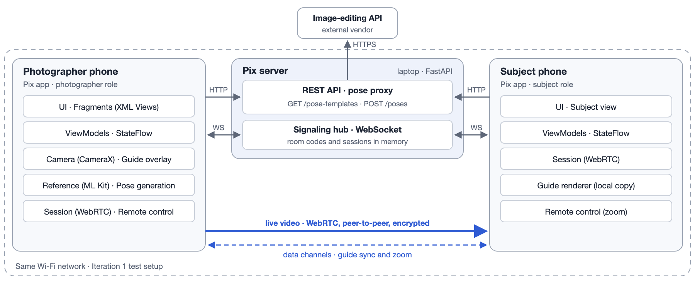

# Pix

Pix is an Android camera app that helps two people get the portrait one of them has in mind. When friends photograph each other, the person in the photo usually knows the pose and framing they want, but only the photographer sees the screen. Pix gives both people the same view: the photographer puts a pose guide on the camera, and the friend's phone shows the live camera with the same guide and can adjust the zoom. The photographer takes the photo, and it is saved at full quality without the guide.

This branch is the **Iteration 1 prototype**: two phones and a laptop running the Pix server on one Wi-Fi network, connected with a room code.

## Demo videos

Recorded on real phones with the Iteration 1 build (#34).

**Camera**: zoom slider, composition grid, and level bar

https://github.com/user-attachments/assets/359779b9-ea86-4ce6-8425-9a0eb07146dd

**Guide overlay**: drag, pinch, and opacity

https://github.com/user-attachments/assets/54f37994-fe68-483a-82b1-97c35ff123a1

**AI pose generation**

https://github.com/user-attachments/assets/c45d7a0f-5084-4287-9bcc-bf081cc381d1

**Shoot together**: the subject's phone (left) and the photographer's phone (right)

https://github.com/user-attachments/assets/fced811f-32ba-423f-a3ff-5e789ff96e9a

## What Iteration 1 does

| Feature | What you can do |
|---|---|
| **Camera** | Pix opens straight to the rear camera in a 3:4 frame. A zoom slider covers the phone's real range, a 3×3 grid and a level bar help with composition, and photos are saved at full resolution to a "Pix" album, without the guide. |
| **Guide from a photo** | Pick a gallery photo. Pix separates the person on the phone with ML Kit Subject Segmentation and offers a semi-transparent cutout or an outline. The photo never leaves the phone. |
| **AI pose generation** | Take a photo of the scene. The Pix server asks an image-editing model (GPT Image 2.5 Flare through OpenRouter) for four poses of the same person in the same place: hands on hips, wave, walking, and arms crossed. The chosen pose becomes the guide. |
| **Guide overlay** | Drag the guide, pinch it to 30–300% of its size, fade it to 10–90%, switch between cutout and outline, or remove it. |
| **Shoot together** | The photographer gets a 6-digit room code, and the friend joins with it. The friend's phone shows the live camera over WebRTC with the same guide, and the friend's zoom slider changes the photographer's zoom. Only the photographer takes photos. |

### Next: Iteration 2

- Pix IDs, friends, and invitations that the friend can accept or decline
- Connections over Wi-Fi or cellular data, with automatic reconnection
- More remote controls from the friend's phone: moving and resizing the guide, brightness, and flash, with a switch to allow or block them
- Poses described in words, and saved guides to reuse

The plan for every iteration is in [Requirements and Specifications §4.1](https://github.com/snuhcs-course/swpp-2026-project-team-10/wiki/Requirements-and-Specifications#41-scope-by-iteration).

## How it works



- **Pix server** (FastAPI, on a laptop in Iteration 1): creates room codes, relays the WebRTC connection setup between the two phones, and forwards pose requests to the image-editing API, which keeps the API key off the phones. It never sees the video.
- **Phone to phone** (WebRTC): the live video, the guide image, guide positions, and zoom requests go directly between the two phones. Each phone draws the guide itself, so it never appears in the video or in saved photos.
- **On the phone**: the camera (CameraX) and the person separation for guides (ML Kit) run on the phone.

The full design is in the [Design Documentation](https://github.com/snuhcs-course/swpp-2026-project-team-10/wiki/Design-Documentation).

## Technology stack

| Part | Stack |
|---|---|
| Android app | Kotlin 2.2, XML Views with ViewBinding, Navigation, ViewModel and coroutines · CameraX 1.6 · ML Kit Subject Segmentation · WebRTC (`io.github.webrtc-sdk:android` 137) · OkHttp 4.12 and Retrofit 2.11 with kotlinx.serialization · Jetpack DataStore |
| Server | Python 3.11 · FastAPI and Uvicorn (WebSocket signaling and REST API) · pydantic-settings · httpx2 · Pillow |
| AI | OpenRouter Image API with GPT Image 2.5 Flare at low quality (a server setting) |
| Tests and CI | JUnit 4 and Robolectric 4.17 · Spotless with ktlint · Ruff and pytest · GitHub Actions |

## Development environment

| Part | Requirements |
|---|---|
| Android app | Android Studio with its bundled JDK (21 or later is needed for the unit tests), Kotlin 2.2, Gradle 9.5 through the wrapper. minSdk 29 (Android 10), target and compile SDK 36. |
| Server | Python 3.11 or later and [uv](https://docs.astral.sh/uv/getting-started/installation/). An [OpenRouter](https://openrouter.ai/) API key with credits for pose generation. |
| Tested on | Galaxy S22, S23 Ultra, S25 Ultra, S21 Ultra, and Note 9 (Android 10, the minimum version) |
| Network | One Wi-Fi network for the laptop and both phones that allows traffic between devices. A phone hotspot works; campus Wi-Fi usually blocks it. |

## Run the demo

### 1. Get the code

```sh
git clone https://github.com/snuhcs-course/swpp-2026-project-team-10.git
cd swpp-2026-project-team-10
git checkout iteration-1-demo
```

### 2. Start the server on the laptop

From the repository root:

```sh
cd server
uv sync --locked
cp .env.example .env
```

Put your OpenRouter key in `server/.env` as `OPENROUTER_API_KEY=...`. Without it, everything except pose generation still works. Then start the server:

```sh
uv run uvicorn pix_server.main:app --host 0.0.0.0 --port 8000 --workers 1 --ws-max-size 65536
```

Find the laptop's Wi-Fi address (on macOS, `ipconfig getifaddr en0`) and check `http://<laptop-IP>:8000/health` from a phone's browser; it answers `{"status":"ok"}`.

### 3. Install the app on both phones

Create `android/local.properties` with the laptop's address:

```properties
pix.serverUrl=http://<laptop-IP>:8000/
```

Connect a phone with USB debugging on, then from `android/`:

```sh
./gradlew :app:installDebug
```

Repeat for the second phone. On an emulator, skip `local.properties`: the default address `http://10.0.2.2:8000/` already reaches the laptop.

### 4. Try the flows

1. **Guide from a photo.** On the Camera screen, tap *Guide* › *Upload a reference*, pick a photo of a person, and tap *Use this guide*. Drag, pinch, and fade the guide, then take a photo: "Saved without the guide" appears and the thumbnail changes. The first time, the segmentation model is downloaded through Google Play services, which can take a minute.
2. **AI poses.** Tap *Guide* › *Generate poses here*, accept the notice, take a photo of the scene, and tap *Use this photo*. After 10–30 seconds, tap a pose, *Use this pose*, and *Use this guide*.
3. **Shoot together.** On the photographer's phone, tap *Shoot together* to get a code. On the friend's phone, tap *Shoot together* › *Join with a code instead*, enter the code, and tap *Join*. The friend sees the live camera and the same guide. Moving the friend's zoom slider changes the photographer's zoom, and the photographer takes the photo. *Leave* or *End session* ends it.

With one phone, `server/tools/fake_photographer.py` or `server/tools/fake_subject.py` can play the other side; see the [server README](server/README.md#testing-the-photographers-phone-without-a-second-phone).

## Tests and checks

Every pull request runs these in GitHub Actions; run them locally before you push.

| Part | From | Command |
|---|---|---|
| Android | `android/` | `./gradlew spotlessCheck :app:lintDebug :app:testDebugUnitTest :app:assembleDebug` |
| Server | `server/` | `uv run ruff check . && uv run ruff format --check . && uv run pytest` |

More detail is in the [Android README](android/README.md) and the [server README](server/README.md).

## Repository

| Folder | Contents |
|---|---|
| `android/` | The Android app (open this folder in Android Studio) |
| `server/` | The Pix server, its tests, and tools for testing with one phone |
| `wiki/` | The source of the GitHub wiki, published on every push to `dev` |
| `.github/` | CI workflows and the pull request template |

Branches: `main` holds the stable version and `dev` is the integration branch. Each task is a branch from `dev` that returns through a reviewed, squash-merged pull request. `iteration-N-demo` holds the code shown in that iteration's demo, and at the end of an iteration `dev` is merged into `main`.

## Documents

- [Requirements and Specifications](https://github.com/snuhcs-course/swpp-2026-project-team-10/wiki/Requirements-and-Specifications)
- [Design Documentation](https://github.com/snuhcs-course/swpp-2026-project-team-10/wiki/Design-Documentation)
- [Team Meetings](https://github.com/snuhcs-course/swpp-2026-project-team-10/wiki/Team-Meetings) and [Daily Standup Meeting Log](https://github.com/snuhcs-course/swpp-2026-project-team-10/wiki/Daily-Standup-Meeting-Log)

## Team

SWPP 2026 Team 10: 박동제 (PM in Iteration 1, reference guide), 박재완 (server, AI, pose generation), 조성민 (real-time streaming, guide sync, remote zoom), 한준형 (camera, overlay, integration; PM in Iteration 2).
