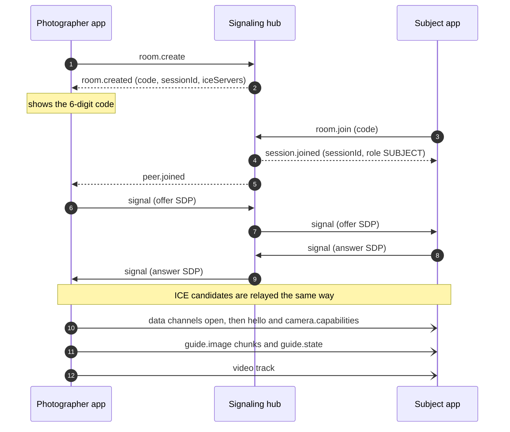
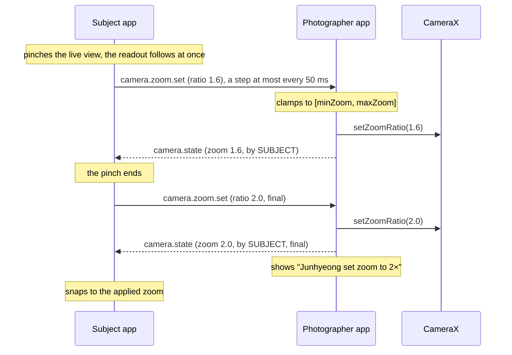
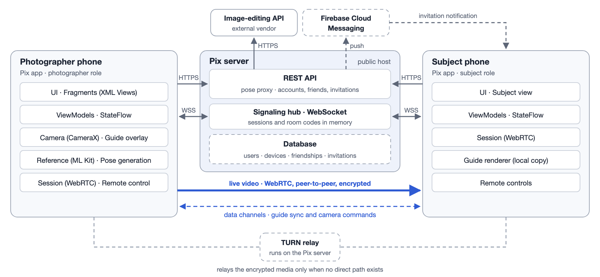
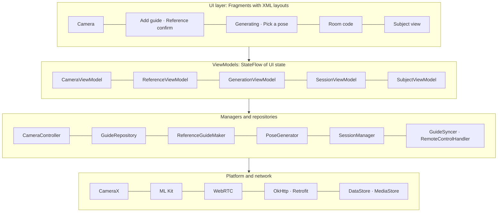
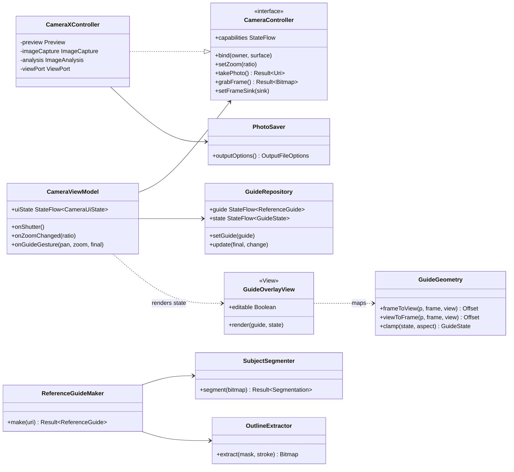
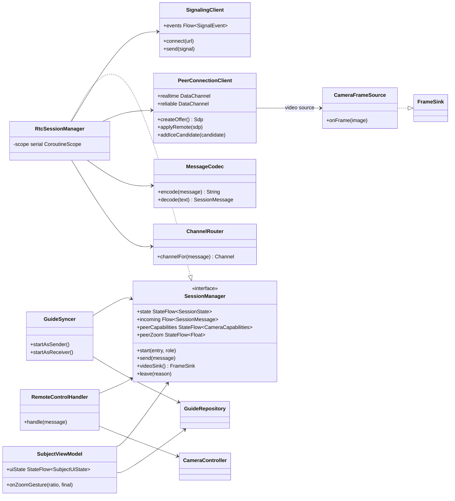
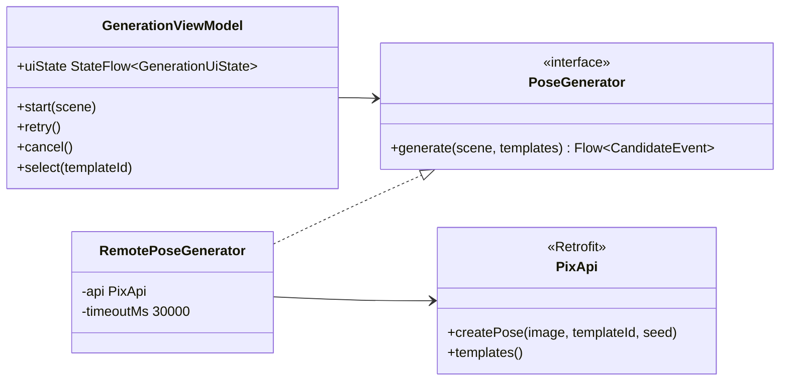
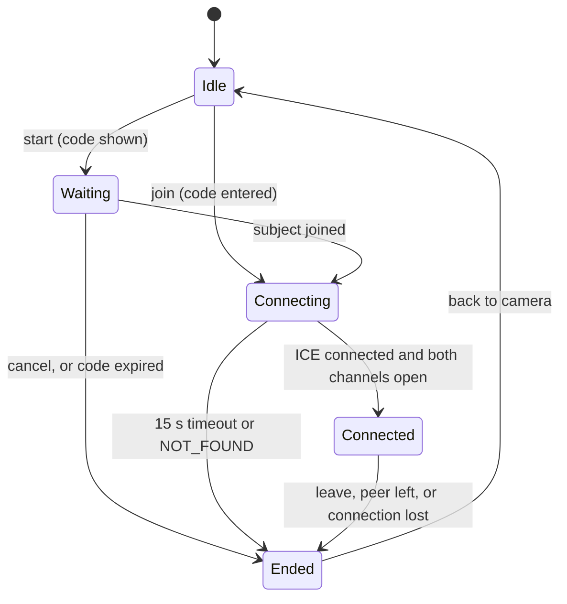

## Document Revision History

| Version | Date | Key changes |
|----|----|----|
| 0.1 | 2026-09-30 | Initial draft: system architecture, external libraries, architectural decisions, Android app structure and module interfaces, class diagrams, data models, state machines, protocols and APIs, algorithms, database schema, implementation decisions, module ownership, and the Iteration 1 build order. The shared contracts (interfaces, models, messages, API) are also in `android/`. |
| 0.2 | 2026-09-30 | Iteration 1 design developed: a JSON example for every data channel message, signaling message, and REST endpoint (2.5); the Iteration 1 test setup, with both phones and the server (a laptop) on the same Wi-Fi (Figure 1); the remote zoom flow (Figure 3); guide sync and remote control as separate modules (2.9). Added the plan for Iterations 2–5 with the target architecture (1.4): friends and invitations, cellular connections, more remote controls, saved guides, an offline connection with a QR code, and guides that keep the background. The photographer takes every photo. |
| 0.3 | 2026-10-04 | Pose generation as built: the image-editing API is OpenRouter's Image API with the model as a server setting, and the selection result is recorded (2.6.3); a prompt that lets the model re-place the person (2.6.3); the server validates the scene photo and does not resize it (1.1.2, 2.2); `400 INVALID_REQUEST` and a 1 MiB request limit (2.5.3); a 30 s upstream timeout, and the server cancels the image API call when the phone disconnects (2.6.3, 2.8); rate limiting per client address (2.8). |
| 0.4 | 2026-10-05 | Remote zoom as built: the subject pinches the live view instead of tapping zoom chips (Figure 3, Figure 7, 2.6.5), and `CameraCapabilities.zoomStops` stays in the contract for later subject controls (2.3, 2.5.1, 2.6.2); `camera.zoom.set` carries `final`, with pinch steps on the realtime channel at most every 50 ms and the last value on the reliable channel (2.5.1); every applied zoom is echoed as `camera.state`, only a final request shows the remote-action notice, and the subject ignores echoes while its pinch is in progress (2.6.5); `SessionManager` keeps the last `camera.capabilities` and the last echoed zoom for a Subject view that opens late (2.1); *Remote control* owns pinch zoom on Subject view (2.9). |

Audience: the development team. This page describes the Iteration 1 design in detail; each later iteration adds the design for the features it builds (1.4). **TBD** marks an open decision. Requirement IDs (FR-, NFR-) refer to the Requirements and Specifications page. Testing plans are in the Testing Documentation.

**Decided (2026-09-30):** XML Views with ViewBinding and the Navigation component · FastAPI (Python) server · package `com.lastpenguin.pix` · minSdk 29 (Android 10), target and compile SDK 36 · Iteration 1 test setup: both phones and the server, which runs on a laptop, on the same Wi-Fi network.

**Decided (2026-10-04):** the image-editing API is OpenRouter's Image API, with the model as a server setting; the default is GPT Image 2.5 Flare at low quality (2.6.3).

**Still open**

| Decision | Current proposal | Owner | Decide by |
|----|----|----|----|
| WebRTC build for Android | A maintained prebuilt of libwebrtc (Google no longer publishes an official Android artifact) | Real-time | 10/2 |
| Detailed design of later features (1.4) | Designed at the start of the iteration that builds each feature | Team | Start of each iteration |

**Contents**

- [1. System Design](#1-system-design)
  - [1.1 System Architecture](#11-system-architecture)
  - [1.2 External libraries and services](#12-external-libraries-and-services)
  - [1.3 Architectural decisions](#13-architectural-decisions)
  - [1.4 Later iterations](#14-later-iterations)
- [2. Design Details](#2-design-details)
  - [2.1 Android app structure](#21-android-app-structure)
  - [2.2 Class diagrams](#22-class-diagrams)
  - [2.3 Data models](#23-data-models)
  - [2.4 State machines](#24-state-machines)
  - [2.5 Protocols and APIs](#25-protocols-and-apis)
  - [2.6 Algorithms and AI components](#26-algorithms-and-ai-components)
  - [2.7 Database](#27-database)
  - [2.8 Implementation decisions](#28-implementation-decisions)
  - [2.9 Module ownership and build order](#29-module-ownership-and-build-order)
  - [2.10 Repository and branches](#210-repository-and-branches)
- [3. Design Patterns (Iteration 5)](#3-design-patterns-iteration-5)

## 1. System Design

### 1.1 System Architecture

#### 1.1.1 High-level architecture

Pix is one Android app that runs in two roles, **photographer** and **subject**, plus a small **Pix server**. The system separates a **control plane** from a **media plane**:

- **Control plane (client-server).** The server connects the two phones (signaling) and forwards pose-generation requests to the external API. In Iteration 1 it runs on a laptop on the same Wi-Fi as both phones.
- **Media plane (peer-to-peer).** The live video and all control messages go directly between the two phones over WebRTC.


*Figure 1. High-level architecture in Iteration 1. Both phones and the Pix server, which runs on a laptop, are on the same Wi-Fi network; only the image-editing API is outside it.*

#### 1.1.2 Components and interfaces

| Component | Runs on | Responsibility | Interfaces |
|----|----|----|----|
| **Pix app, photographer role** | Android | Owns the camera. Builds and edits the guide, captures photos, requests pose generation, streams video, and applies remote commands. | CameraX; ML Kit; WebRTC (sends video); data channels; REST; signaling |
| **Pix app, subject role** | Android | Shows the live video with a locally drawn copy of the guide and sends zoom requests. | WebRTC (receives video); data channels; signaling |
| **Signaling hub** | Pix server | Creates room-code sessions and relays SDP offers, answers, and ICE candidates. It never sees media. | WebSocket, JSON (2.5.2) |
| **Pose proxy** | Pix server | Holds the API key, validates the scene photo, calls the image-editing API with a template prompt, enforces the 30 s upstream timeout and rate limits, and cancels the upstream call when the phone drops the request. | REST `POST /api/v1/poses` (2.5.3) |
| **Image-editing API** | External | Generates the same person in the same scene with a different pose. | OpenRouter's Image API (`POST https://openrouter.ai/api/v1/images`); the model is a server setting, `openai/gpt-image-2.5-flare@low` by default (2.6.3) |

#### 1.1.3 Key data flows

| Flow | Path | Transport | Latency budget |
|----|----|----|----|
| **Reference photo → guide** | Photo picker → downscale → ML Kit segmentation → cutout and outline → guide store | On device only | ≤ 2 s (NFR-3) |
| **Pose generation** | Camera frame → JPEG (resized on the phone, EXIF removed) → 4 parallel requests → pose proxy → image API → candidates → reference flow | HTTPS | First ≤ 20 s, all ≤ 30 s (NFR-4) |
| **Session setup** | Room code → signaling → SDP and ICE exchange → peer connection | WebSocket, then WebRTC | ≤ 10 s after Join (US-13) |
| **Live view** | CameraX frames → I420 → WebRTC encoder → peer → subject renderer | SRTP, peer-to-peer | ≤ 0.5 s on Wi-Fi (NFR-5) |
| **Guide sync** | Guide store (photographer) → `guide.state` → subject's guide store → overlay | Data channel | ≤ 0.3 s (NFR-7) |
| **Remote zoom** | Subject → `camera.zoom.set` → clamp → CameraX → echo of the applied zoom | Data channel | ≤ 0.5 s (NFR-7) |

#### 1.1.4 Main sequences

**Session setup with a room code**



*Figure 2. Connecting two phones with a room code. The photographer always creates the offer.*

**Remote zoom**



*Figure 3. The photographer's phone applies each request and echoes the value it applied, so both phones end on the same zoom. Only the photographer takes photos.*

#### 1.1.5 Architectural patterns

- **System level: client-server plus peer-to-peer.** The server handles discovery and AI calls. Real-time media never passes through our application code on the server.
- **App level: MVVM with unidirectional data flow.** Fragments with XML layouts (ViewBinding) render immutable UI state from a ViewModel (`StateFlow`) and send user events back to it. ViewModels call repositories and managers, which wrap CameraX, ML Kit, WebRTC, and the network. This keeps camera and network code out of the UI, so each part can be tested and replaced on its own.
- **Single source of truth per session.** The photographer's phone owns the camera state and the guide state. The subject's phone keeps a mirror that is updated only by messages. Subject actions are *requests* that the photographer applies and then confirms.

### 1.2 External libraries and services

| Library / service | Used for | Where |
|----|----|----|
| Kotlin, Coroutines, Flow | Language; background work; streams of state and messages | App |
| AppCompat, Material Components, Fragment, Navigation component, ViewBinding, Lifecycle ViewModel | XML screens, the navigation graph, state that survives rotation | App |
| CameraX 1.6 (`core`, `camera2`, `lifecycle`, `view` for PreviewView) | Preview, ImageCapture, ImageAnalysis (frames for streaming), zoom | App |
| ML Kit Subject Segmentation (Google Play services) | On-device foreground bitmap and confidence mask for the cutout and outline | App |
| WebRTC for Android (prebuilt, **TBD**) | Peer connection, H.264/VP8 video, two data channels, ICE | App |
| OkHttp (+ Retrofit for REST) | WebSocket signaling and HTTPS requests | App |
| kotlinx.serialization (JSON) | Data channel, signaling, and REST payloads | App |
| Jetpack DataStore | Small preferences: consent given, last zoom | App |
| FastAPI, Uvicorn, pydantic-settings, python-multipart, httpx2, Pillow (Python) | One process that serves WebSocket signaling and the REST API; settings from environment variables; multipart uploads; calls to the image API; checking the scene photo and converting candidates to JPEG | Server |
| OpenRouter Image API | Pose candidate generation with an image-editing model chosen by a server setting (2.6.3) | Server |

### 1.3 Architectural decisions

| ID | Decision | Why | Rejected alternative |
|----|----|----|----|
| AD-1 | **Generate poses with an external image-editing API, called through our server** | On-device generative models have no supported Android path and are too heavy for the semester. Calling through the server keeps the API key out of the app and lets us switch vendors or rate-limit in one place. Cost: network dependency and per-request fees, so generation runs only on request. | On-device model (DreamLite); calling the API directly from the app |
| AD-2 | **Segment the reference on the device (ML Kit)** | Fast (≤ 2 s), free, works offline, and the reference photo never leaves the phone (FR-2.6). It runs once per reference. | Segmentation on the server or inside the image API |
| AD-3 | **Peer-to-peer media with WebRTC; the server only does signaling** | Lowest latency for the live view, no media-server cost, end-to-end encryption. WebRTC also provides congestion control and adaptive quality (NFR-6). | Media server (SFU); sending JPEG frames over WebSocket |
| AD-4 | **CameraX is the only camera owner and feeds frames to WebRTC** | Only one client can open the camera. CameraX gives us capture, zoom, focus, and exposure for remote control, and one viewport for preview, capture, and streaming, so all three show the same framing. | WebRTC's built-in camera capturer |
| AD-5 | **Two data channels: *realtime* (unordered, no retransmission) and *reliable* (ordered)** | Continuous values (guide position, zoom) need only the latest value, and retransmitting stale ones adds lag. Images, commands, and results must arrive exactly once. Both reuse the existing peer connection, so there is no server round trip. | One reliable channel; relaying messages through the server |
| AD-6 | **Each phone draws the guide itself; only the image (once) and small state updates are sent** | The guide stays sharp on the subject's phone. It never enters the video or the saved photo. Updates are a few bytes, and the subject can view the guide style it prefers later. | Burning the overlay into the video stream; mirroring the photographer's screen |
| AD-7 | **The photographer's phone is the single source of truth for camera and guide state** | Avoids conflicting edits: subject actions are requests; the photographer applies them in arrival order and echoes the applied value, so the later change wins and both phones agree (FR-7.6). | Shared editing on both phones |
| AD-8 | **One session abstraction with pluggable entry points (room code now, invitation later)** | Iteration 1 tests the riskiest part (streaming and sync) without accounts. In Iteration 2 only the entry point changes: an accepted invitation yields a `sessionId`, just like a room code does. | Building accounts and invitations first |
| AD-9 | **One app for both roles** | Friends swap roles between shots. One codebase and one install, with the role chosen per session. | A separate viewer app for the subject |
| AD-10 | **Fixed 3:4 frame, shown whole (fit) on both phones** | 3:4 is the sensor's native ratio, so photos keep full resolution. Showing the whole frame on both phones means guide coordinates map identically and what you see is what is captured. | Full-screen 9:16 with cropping |

### 1.4 Later iterations

Iteration 1 builds the core on one Wi-Fi network. Later iterations add the features below on the same structure. This section says what each iteration adds and how the design changes; the detailed design of each feature (messages, APIs, schemas, and classes) is added to this document at the start of the iteration that builds it.



*Figure 4. Target architecture from Iteration 2. The dashed parts are added in Iteration 2: a database, push notifications for invitations, and a relay for cellular connections. The server moves from the laptop to a public host.*

#### 1.4.1 Iteration 2 · from 10/11 (midterm presentation 10/21)

| Feature | How the design changes |
|----|----|
| **Friends and invitations** (F5, F6) | Sign-in (Google, **TBD**) only for friends. The server adds accounts, Pix IDs, friend requests, and invitations, kept in a database. An invitation reaches the friend by push notification even when Pix is closed. Accepting it creates a session the same way a room code does, so the session and peer connection code is shared (AD-8). Room codes stay for people without an account. |
| **Connections over cellular data** (F6) | A relay (TURN) on the server forwards the encrypted media when no direct path exists, with short-lived credentials from the server. After a network change, the phones reconnect within 10 s with an ICE restart. |
| **More remote controls** (F7) | The subject moves and resizes the guide and sets the brightness and flash, and the photographer can allow or block remote control. Each is a new data channel message with the same request → apply → echo pattern as the zoom (AD-7). |
| **Saved guides** (FR-3.8) | Guides are saved in the app's private storage and loaded back into `GuideRepository`. They never leave the phone. |
| **Camera and generation** (FR-1.4, FR-3.6, FR-4.8) | Tap to focus; hiding and replacing the guide; poses described in words, sent to the server with the scene photo. |

**Planned decisions**, confirmed at the start of Iteration 2:

- Invitations are delivered by Firebase Cloud Messaging, because Android does not let a closed app keep a WebSocket open.
- A TURN relay (for example, coturn) is needed, because STUN alone often fails on carrier networks.
- The server moves from the laptop to a public host with HTTPS and WSS (NFR-14).
- The database (for example, PostgreSQL) stores users, devices, friend requests, friendships, and invitations. Sessions, room codes, and online presence stay in memory.

#### 1.4.2 Iterations 3–4 · heuristic evaluation 11/2, user acceptance test 11/6

| Feature | How the design changes |
|----|----|
| **Offline connection with a QR code** (F9) | The photographer's phone opens a local-only hotspot and runs the signaling itself, so neither the server nor a shared Wi-Fi is needed. The QR code carries the hotspot's connection details. The phone accepts only one connection per QR code, and the session starts only after both people tap *Resume*. This is another session entry point (AD-8). |
| **Guides that keep the background** (FR-2.8) | A third guide style next to cutout and outline. It is placed on the full frame, so the background lines up with the scene. |
| **Remote focus and sharing photos** (FR-7.7, FR-6.14) | The subject sets the focus point, and the photographer can send a photo to the subject over the data channel. |
| **Evaluation and UAT** | Fixes from the heuristic evaluation. The UAT user stories are fixed by the end of Iteration 3 and tested in Iteration 4. |

#### 1.4.3 Iteration 5 · polish and final release

Polish, stability, and performance work against the NFR targets based on UAT feedback, and the design patterns in section 3.

## 2. Design Details

### 2.1 Android app structure



*Figure 5. Layers of the Android app. Each layer depends only on the layer below it.*

**Package layout.** Files marked \* already exist in `android/` as shared contracts; the owners create the rest.

```text
android/app/src/main/java/com/lastpenguin/pix/
├─ MainActivity*
├─ ui/          camera/, guide/, generation/, session/: one Fragment and ViewModel per wireframe screen
├─ camera/      CameraController*, CameraXController, PhotoSaver
├─ guide/       GuideModels*, GuideRepository*, ReferenceGuideMaker*,
│               GuideGeometry, SubjectSegmenter, OutlineExtractor, overlay view
├─ generation/  GenerationModels*, PoseGenerator*, RemotePoseGenerator
├─ session/     SessionModels*, SessionManager*, RtcSessionManager, SignalingClient,
│               GuideSyncer, RemoteControlHandler
│  ├─ protocol/  SessionMessage*, message codec, channel routing
│  └─ signaling/ SignalMessage*
└─ core/        network/PixApi*, network/ApiModels*, dependency wiring, timing logs
```

#### Module interfaces

These interfaces are the contracts between owners. Each owner starts with a fake implementation (for example, a `FakeSessionManager` that echoes messages), so that UI and sync work can begin before the real module is ready.

```kotlin
interface CameraController {
    val capabilities: StateFlow<CameraCapabilities?>
    val zoom: StateFlow<Float>                        // applied ratio relative to primary rear camera
    fun bind(owner: LifecycleOwner, surface: Preview.SurfaceProvider)
    fun setZoom(ratio: Float)                          // primary-relative, clamped to [minZoom, maxZoom]
    suspend fun takePhoto(): Result<Uri>               // full resolution, Pictures/Pix, no overlay
    suspend fun grabFrame(): Result<Bitmap>            // latest frame, upright: the scene photo (FR-4.1)
    fun setFrameSink(sink: FrameSink?)                 // null stops streaming frames
}
fun interface FrameSink { fun onFrame(image: ImageProxy) }   // must copy the image and close it before returning

interface ReferenceGuideMaker {                         // fails with NoPersonFoundException (FR-2.4)
    suspend fun make(source: Uri): Result<ReferenceGuide>                        // gallery photo
    suspend fun make(bitmap: Bitmap, source: GuideSource): Result<ReferenceGuide> // pose candidate
}

interface GuideRepository {
    val guide: StateFlow<ReferenceGuide?>
    val state: StateFlow<GuideState>
    val changes: SharedFlow<GuideChange>               // every applied change, for GuideSyncer
    fun setGuide(guide: ReferenceGuide?)                 // null removes the guide
    fun update(final: Boolean, change: (GuideState) -> GuideState)   // final = gesture ended
}

interface PoseGenerator {
    suspend fun templates(): List<PoseTemplate>                     // GET /pose-templates
    fun generate(scene: Bitmap, templates: List<PoseTemplate>, seed: Long): Flow<CandidateEvent>   // one event per template
}

interface SessionManager {
    val state: StateFlow<SessionState>
    val incoming: Flow<SessionMessage>                  // not replayed: a late subscriber misses earlier messages
    val peerCapabilities: StateFlow<CameraCapabilities?> // subject: the last camera.capabilities, for a screen that opens late
    val peerZoom: StateFlow<Float?>                     // subject: the zoom from the last camera.state, null until one arrives
    suspend fun start(entry: SessionEntry, role: Role)
    fun send(message: SessionMessage)                   // ChannelRouter picks realtime or reliable
    fun videoSink(): FrameSink                          // photographer: pass to CameraController
    suspend fun leave(reason: EndReason = EndReason.LEFT)
}
```

### 2.2 Class diagrams

The diagrams show the main classes and their responsibilities. They are not complete UML.



*Figure 6. Camera and guide classes*



*Figure 7. Session, synchronization, and remote-control classes*



*Figure 8. Pose generation classes*

**Server modules.** One process with these modules (independent of the framework choice):

| Module | Responsibility |
|----|----|
| `signaling` | WebSocket hub; `SessionRegistry` (in-memory map of sessionId → up to two peers, room codes, and TTLs); relays `signal` messages |
| `poses` | The REST endpoints (scene photo validation, rate limiting, cancelling when the phone disconnects); `PoseGenerator`, the one client of OpenRouter's Image API, with the model as a setting; the template catalog and prompt |

### 2.3 Data models

```kotlin
// ---- Guide ----------------------------------------------------------------
data class ReferenceGuide(
    val id: String,               // UUID; the subject uses it to tell whether it already has the image
    val cutout: Bitmap,           // ARGB_8888, person only, transparent background, cropped to the person
    val outline: Bitmap,          // same size as cutout; 2–3 px light stroke
    val aspect: Float,            // cutout width / height
    val source: GuideSource,      // GALLERY or GENERATED
)
enum class GuideStyle { CUTOUT, OUTLINE }

data class GuideState(            // everything needed to place the guide, in frame coordinates
    val guideId: String? = null,  // null = no guide
    val cx: Float = 0.5f,         // guide center, 0..1 of the 3:4 portrait frame
    val cy: Float = 0.5f,
    val height: Float = 0.7f,     // guide height / frame height; 0.21..2.1 (30–300 % of the start)
    val opacity: Float = 0.5f,    // 0.1..0.9
    val style: GuideStyle = GuideStyle.OUTLINE,
    val visible: Boolean = true,
)

// ---- Camera ---------------------------------------------------------------
data class CameraCapabilities(
    val minZoom: Float, val maxZoom: Float, // relative to the primary rear camera's 1x
    val zoomStops: List<Float>,   // subject-side stops: [0.5, 0.6, 1, 2, 3] filtered to [min, max]; kept for later controls
)

// ---- Session --------------------------------------------------------------
enum class Role { PHOTOGRAPHER, SUBJECT }
sealed interface SessionEntry {
    data object NewRoom : SessionEntry                               // photographer asks for a code
    data class RoomCode(val code: String) : SessionEntry            // subject enters the code
}
sealed interface SessionState {
    data object Idle : SessionState
    data class Waiting(val code: String) : SessionState              // photographer: room code shown, waiting for the subject
    data class Connecting(val sessionId: String?) : SessionState
    data class Connected(val sessionId: String, val peer: PeerInfo, val role: Role) : SessionState
    data class Ended(val reason: EndReason) : SessionState
}
data class PeerInfo(val displayName: String)
enum class EndReason { LEFT, PEER_LEFT, CONNECTION_LOST, NOT_FOUND, EXPIRED, CANCELLED, ERROR }

// ---- Generation -----------------------------------------------------------
data class PoseTemplate(val id: String, val label: String)   // the prompt text stays on the server
sealed interface CandidateEvent {
    val templateId: String
    data class Ready(override val templateId: String, val image: Bitmap) : CandidateEvent
    data class Failed(override val templateId: String, val error: GenerationError) : CandidateEvent
}
enum class GenerationError { OFFLINE, TIMEOUT, RATE_LIMITED, REJECTED, SERVER }
```

### 2.4 State machines



*Figure 9. `SessionState` on each phone*

### 2.5 Protocols and APIs

Each protocol has a summary table, followed by a JSON example for every message or endpoint. Open an item to see its example.

#### 2.5.1 Data channel protocol (phone ↔ phone)

The photographer opens two channels when it creates the offer: `realtime` (`ordered = false`, `maxRetransmits = 0`) and `reliable` (ordered, reliable). Every message uses one JSON envelope: `v` is the protocol version, `t` the type, `seq` a counter per type, `ts` the send time in milliseconds, and `b` the body. In code, `SessionMessage` uses `t` as its class discriminator, so the codec keeps `t` at the top and moves the other fields into `b`. Receivers ignore unknown types, so older builds keep working, and drop a `realtime` message whose `seq` is not newer than the last one applied for that type. Only the photographer takes photos; the subject sends zoom requests.

| Type | Channel | Dir. | Purpose |
|----|----|----|----|
| `hello` | reliable | both | First message; checks the protocol version |
| `camera.capabilities` | reliable | P→S | Zoom range and the zoom stops |
| `guide.image.begin` | reliable | P→S | Starts sending the guide image |
| `guide.image.chunk` | reliable | P→S | One piece of the image |
| `guide.image.end` | reliable | P→S | Ends the image; the subject checks it |
| `guide.state` | realtime / reliable | P→S | Where and how the guide is drawn |
| `guide.clear` | reliable | P→S | The guide was removed |
| `camera.zoom.set` | realtime; `final` reliable | S→P | A step of the subject's pinch, or its last value (`final`) |
| `camera.state` | realtime / reliable | P→S | The zoom actually applied, and who changed it |
| `session.leave` | reliable | both | Leaving on purpose |
| `ping / pong` | realtime | both | Round-trip time for measurement |

<details>
<summary><code>hello</code> · reliable · both</summary>

```json
{
  "v": 1, "t": "hello", "seq": 1, "ts": 1759212345678,
  "b": {
    "protocol": 1,
    "appVersion": "0.1.0",
    "role": "PHOTOGRAPHER",
    "name": "Dongje",
    "haveGuideId": null
  }
}
```

Sent by both phones as soon as the channels open. A different `protocol` ends the session with an error. The subject puts the ID of the guide image it already has in `haveGuideId`.

</details>

<details>
<summary><code>camera.capabilities</code> · reliable · P→S</summary>

```json
{
  "v": 1, "t": "camera.capabilities", "seq": 2, "ts": 1759212345690,
  "b": {
    "capabilities": { "minZoom": 0.6, "maxZoom": 10.0, "zoomStops": [0.6, 1.0, 2.0, 3.0] }
  }
}
```

Sent after `hello`. The subject limits its pinch to `minZoom`–`maxZoom`. `zoomStops` is not shown on Subject view and stays in the contract for later subject controls.

</details>

<details>
<summary><code>guide.image.begin</code> · reliable · P→S</summary>

```json
{
  "v": 1, "t": "guide.image.begin", "seq": 3, "ts": 1759212345702,
  "b": {
    "guideId": "5f0c2b9e-7a41-4d3c-9b1e-2f6a8d0c4e17",
    "format": "webp", "width": 540, "height": 720, "bytes": 48213, "chunks": 5
  }
}
```

Skipped if the subject reported the same `haveGuideId`.

</details>

<details>
<summary><code>guide.image.chunk</code> · reliable · P→S</summary>

```json
{
  "v": 1, "t": "guide.image.chunk", "seq": 4, "ts": 1759212345705,
  "b": { "guideId": "5f0c2b9e-7a41-4d3c-9b1e-2f6a8d0c4e17", "index": 0, "data": "UklGRl68AABXRUJQVlA4WAoAAAAQAAAAHwIAzwIA..." }
}
```

`data` is Base64 of at most 12 KiB, so each message stays under 16 KiB. Chunks are sent only while the channel's `bufferedAmount` is below 256 KiB (2.8).

</details>

<details>
<summary><code>guide.image.end</code> · reliable · P→S</summary>

```json
{
  "v": 1, "t": "guide.image.end", "seq": 9, "ts": 1759212345760,
  "b": { "guideId": "5f0c2b9e-7a41-4d3c-9b1e-2f6a8d0c4e17", "crc32": 3735928559 }
}
```

The subject checks the CRC, decodes the image, and derives the outline itself (2.6.1).

</details>

<details>
<summary><code>guide.state</code> · realtime / reliable · P→S</summary>

```json
{
  "v": 1, "t": "guide.state", "seq": 412, "ts": 1759212349120,
  "b": {
    "state": {
      "guideId": "5f0c2b9e-7a41-4d3c-9b1e-2f6a8d0c4e17",
      "cx": 0.32, "cy": 0.55, "height": 0.7,
      "opacity": 0.5, "style": "OUTLINE", "visible": true
    },
    "final": false
  }
}
```

Sent on `realtime` at most every 50 ms during a gesture, then once with `"final": true` on `reliable` when the gesture ends, so the final state always arrives. The fields are those of `GuideState` (2.3).

</details>

<details>
<summary><code>guide.clear</code> · reliable · P→S</summary>

```json
{ "v": 1, "t": "guide.clear", "seq": 413, "ts": 1759212351002, "b": {} }
```

</details>

<details>
<summary><code>camera.zoom.set</code> · realtime / reliable · S→P</summary>

```json
{ "v": 1, "t": "camera.zoom.set", "seq": 17, "ts": 1759212352310, "b": { "ratio": 2.0, "final": true } }
```

Sent on `realtime` at most every 50 ms during a pinch, then once with `"final": true` on `reliable` when the pinch ends. The photographer clamps each value to the supported range, applies it, and echoes `camera.state` (Figure 3).

</details>

<details>
<summary><code>camera.state</code> · realtime / reliable · P→S</summary>

```json
{ "v": 1, "t": "camera.state", "seq": 58, "ts": 1759212352342, "b": { "zoom": 2.0, "by": "SUBJECT", "final": true } }
```

Same realtime-then-final pattern as `guide.state`. `by` is PHOTOGRAPHER or SUBJECT and drives the notice on the photographer's phone (FR-7.4).

</details>

<details>
<summary><code>session.leave</code> · reliable · both</summary>

```json
{ "v": 1, "t": "session.leave", "seq": 60, "ts": 1759212399000, "b": { "reason": "LEFT" } }
```

Sent before closing, so the other phone shows "left" instead of "connection lost".

</details>

<details>
<summary><code>ping / pong</code> · realtime · both</summary>

```json
{ "v": 1, "t": "ping", "seq": 30, "ts": 1759212360000, "b": { "ts": 1759212360000 } }
{ "v": 1, "t": "pong", "seq": 30, "ts": 1759212360041, "b": { "ts": 1759212360000 } }
```

Every 2 s. `pong` echoes the `ts` of the `ping`, and the round-trip time goes to the `Timings` log.

</details>

#### 2.5.2 Signaling protocol (phone ↔ server, WebSocket)

JSON text frames over `ws://<laptop address>:8000/ws` on the test Wi-Fi, each with a `type` field.

| Client → server | Server → client | Purpose |
|----|----|----|
| `room.create` | `room.created` | The photographer starts a session and gets a code |
| `room.join` | `session.joined` and `peer.joined`, or `error` | The subject joins with the code |
| `signal` | `signal` | Offer, answer, and ICE candidates, relayed unchanged |
| `leave` | `peer.left` | Leaves the session |
| (unknown type) | `error` | Any message the server does not know |

<details>
<summary><code>room.create</code></summary>

```jsonc
// photographer → server
{ "type": "room.create" }

// server → photographer
{ "type": "room.created", "code": "482915", "sessionId": "s_7f3a92c1", "iceServers": [] }
```

Room codes are 6 random digits, unique among active rooms, and expire after 10 minutes without a subject (FR-8.4). `iceServers` is empty on the same Wi-Fi.

</details>

<details>
<summary><code>room.join</code></summary>

```jsonc
// subject → server
{ "type": "room.join", "code": "482915" }

// server → subject
{ "type": "session.joined", "sessionId": "s_7f3a92c1", "role": "SUBJECT", "iceServers": [] }

// server → photographer
{ "type": "peer.joined" }

// or, server → subject, when the code is wrong
{ "type": "error", "code": "NOT_FOUND", "message": "No active room with this code" }
```

Error codes: `NOT_FOUND`, `FULL`, `EXPIRED`. The other phone's name arrives in `hello` on the data channel.

</details>

<details>
<summary><code>signal</code></summary>

```jsonc
// photographer → server → subject
{ "type": "signal", "sdp": { "type": "offer", "sdp": "v=0\r\no=- 4611731400430051336 2 IN IP4 127.0.0.1\r\n..." } }

// either phone → server → the other phone
{ "type": "signal", "candidate": { "sdpMid": "0", "sdpMLineIndex": 0, "candidate": "candidate:1 1 udp 2122260223 192.168.0.12 50000 typ host" } }
```

The photographer always sends the offer, and the subject answers.

</details>

<details>
<summary><code>leave</code></summary>

```jsonc
// phone → server
{ "type": "leave" }

// server → the other phone
{ "type": "peer.left", "reason": "PEER_LEFT" }
```

A session is removed when the photographer leaves, or 60 s after its last phone disconnects.

</details>

<details>
<summary>Unknown type</summary>

```json
{ "type": "error", "code": "UNKNOWN_TYPE", "message": "Unknown message type: room.open" }
```

</details>

#### 2.5.3 REST API (phone ↔ server)

Base URL `http://<laptop address>:8000/api/v1`, JSON responses. Errors use one shape: `{"error": {"code": "UNKNOWN_TEMPLATE", "message": "..."}}`. The one exception is a request over 1 MiB, which is refused with a plain `413` before it is read.

| Endpoint | Purpose | Errors |
|----|----|----|
| `GET /pose-templates` | The pose templates, so they can change without an app update | — |
| `POST /poses` | One pose candidate for one template; the app sends four in parallel | `400 INVALID_IMAGE`, `400 UNKNOWN_TEMPLATE`, `400 INVALID_REQUEST`, `413`, `422 REJECTED`, `429 RATE_LIMITED`, `502 UPSTREAM_ERROR`, `504 UPSTREAM_TIMEOUT` |

<details>
<summary><code>GET /pose-templates</code></summary>

```jsonc
// response 200
[
  { "id": "hands_on_hips", "label": "Hands on hips" },
  { "id": "wave", "label": "Wave" },
  { "id": "walking", "label": "Walking" },
  { "id": "arms_crossed", "label": "Arms crossed" }
]
```

</details>

<details>
<summary><code>POST /poses</code></summary>

```jsonc
// request: multipart/form-data, at most 1 MiB in total
//   image       scene.jpg (JPEG, long side ≤ 1024 px, no EXIF)
//   templateId  "wave"
//   seed        "1829304756" (an integer)

// response 200
{ "templateId": "wave", "image": "/9j/4AAQSkZJRgABAQAAAQABAAD...", "elapsedMs": 11840 }

// response 504
{ "error": { "code": "UPSTREAM_TIMEOUT", "message": "The image service did not answer within 30 s" } }
```

`image` in the response is a Base64 JPEG. The server keeps neither the scene photo nor the result (FR-4.9).

The server checks the photo and does not repair it: one that is not a readable JPEG, is over 1024 px on its long side, or has EXIF gets `INVALID_IMAGE`. `INVALID_REQUEST` means that a part is missing or that `seed` is not an integer. The server reduces `seed` to 0…2³¹−1, the range the image models accept.

</details>

### 2.6 Algorithms and AI components

#### 2.6.1 Reference guide: segmentation and outline

1.  **Load.** Decode the picked image, applying its EXIF rotation, and downscale so the long side is 1280 px.
2.  **Segment.** Run the ML Kit subject segmenter with the foreground bitmap and the foreground confidence mask enabled. The segmenter's model is delivered by Google Play services, so the first use checks that the module is installed and waits for its download.
3.  **Check for a person.** If fewer than 2% of the pixels have confidence ≥ 0.5, the step fails with `NoPersonFound` (FR-2.4). All detected subjects are kept (FR-2.5).
4.  **Cutout.** Use the foreground bitmap and crop it to the bounding box of the mask (confidence ≥ 0.5) plus a 2% margin. Store the result's aspect ratio.
5.  **Outline.** Threshold the mask at 0.5. A foreground pixel with at least one background pixel among its 8 neighbors becomes an edge. Dilate the edges to a 2–3 px stroke (scaled to the output size) and draw them in a light color on a transparent bitmap of the cutout size.
6.  **Hand over.** Put the `ReferenceGuide` into `GuideRepository`. The subject receives only the cutout (WebP with alpha, height ≤ 720 px) and runs step 5 on its alpha channel, which halves the data sent.

All steps run on `Dispatchers.Default`. Target: ≤ 2 s from selection to *Reference confirm* (NFR-3).

#### 2.6.2 Guide geometry (shared coordinates)

All phones use the same 3:4 portrait frame (AD-10). CameraX binds Preview, ImageCapture, and ImageAnalysis in one `UseCaseGroup` with a 3:4 `ViewPort`, so the preview, the saved photo, and the streamed frame cover the same field of view. Each phone shows the whole frame, fitted and centered:

```text
frame  W × H   (e.g. 720 × 960)          view  w × h   (the preview or the remote video area on screen)
scale  s  = min(w / W, h / H)            offset  ox = (w − W·s) / 2,   oy = (h − H·s) / 2

frame → view:   x = ox + cx · W · s          y = oy + cy · H · s
view  → frame:  cx = (x − ox) / (W · s)      cy = (y − oy) / (H · s)
guide size on screen:   hPx = height · H · s,   wPx = hPx · aspect
```

**Photographer composition aids (FR-1.9–1.10).** `CameraCompositionView` uses this same fit-centered image rectangle to draw lines at one-third and two-thirds in each direction. A short horizon bar is centered in the middle cell, with fixed horizontal end markers and a middle segment that counter-rotates with device roll. `CameraLevelMonitor` reads the gravity sensor, falling back to the accelerometer, while the view is resumed. It smooths gravity vectors before computing the screen-relative angle; level enters within ±2° and exits beyond ±3°. When level, the bar aligns horizontally and turns dark yellow (`#D4AC24`). Invalid sensor readings or an almost face-up/down phone hide the bar. These are non-interactive local View overlays and do not enter photos, analysis frames, or the WebRTC stream. Photographer zoom uses continuous preview pinch and an applied-ratio readout; Subject view pinches the live view the same way, and `CameraCapabilities.zoomStops` stays in the contract for later subject controls.

**Gestures.** The photographer's pan and zoom deltas are converted with *view → frame* and applied to `GuideState`. `height` is limited to 0.21–2.1, and `cx`, `cy` are limited so that at least 20% of the guide's width and height stay inside the frame (FR-3.2, FR-3.3). Because only frame coordinates are sent, the subject's phone places the guide on the same part of the image regardless of its screen size (FR-3.7, NFR-8).

The guide's normalized width is `height × aspect × 4/3`. For either normalized dimension `d`, the center is limited to `[v − d/2, 1 − v + d/2]`, where `v = min(0.2 × d, 1)`. Centers may therefore lie outside 0–1. If an unusually wide guide exceeds five frame widths, showing 20% is impossible at that scale; keep the whole frame width covered instead, preserving the 30–300% scale range. Geometry also clamps opacity to 0.1–0.9. Non-finite state values reset to their defaults. Coordinate conversion requires finite points and positive, finite frame and view sizes, so callers wait for layout before converting touches.

#### 2.6.3 Pose generation

1.  **Scene photo, prepared on the phone.** The app takes the latest analysis frame (or a still from ImageCapture), rotates it to portrait, resizes it so the long side is at most 1024 px, and encodes it as JPEG (quality 85), which leaves out location and other metadata. This preparation is the app's job: the server checks the photo but does not resize or repair it, and rejects one that is not prepared this way (2.5.3). Doing it on the phone keeps the four uploads small and keeps location data on the phone.
2.  **Requests.** Send one `POST /poses` per template (4 in parallel), each with a new random `seed`. *Try other poses* repeats the same templates with new seeds. A model without seed support ignores the seed, and its results still differ from one request to the next.
3.  **Server prompt.** Each template holds a pose description. The server wraps it in a fixed prompt, which lets the model move the person to a better spot while the camera framing stays fixed: *"Keep the same person (face, hair, clothing). Keep the background, camera position, framing, and lighting exactly as they are: do not zoom, crop, or shift the scene. Recompose the shot like a skilled photographer would: judge whether the person is too far, too close, or poorly placed, and if so move them to a better spot and distance in this scene. Change the person's pose to: {pose}. Show the full body, standing on the ground at a natural scale. Photorealistic."*
4.  **Progressive results.** The app maps each response to a `CandidateEvent`. The screen fills its slots as events arrive and moves to *Pick a pose* when all are done, or at 30 s if at least one is ready. Zero candidates means *Couldn't create poses* (FR-4.7).
5.  **Cancellation.** *Cancel* cancels the coroutine scope, which cancels the HTTP calls. The server notices that the phone closed its connection and cancels its own call to the image API, which then does not bill that image. The server also stops waiting for the image API after 30 s.

**API selection.** Poses are generated through OpenRouter's Image API (`POST https://openrouter.ai/api/v1/images`), which gives one request format, one key, and one bill for every vendor's models. The model is the server setting `PIX_POSE_MODEL`, so it changes without a code change. The default is `openai/gpt-image-2.5-flare@low`, GPT Image 2.5 Flare at low quality.

**Why this model.** GPT Image 2.5 Flare at low quality, Seedream 5.0 Flash, and Gemini 3.1 Flash have similar latency, and all three gave decent results. Among them cost decided: GPT Image 2.5 Flare is the cheapest, at $0.012 per image against $0.018 for Seedream and $0.068 for Gemini.

The models were compared on 2026-10-03 and 2026-10-04 with `server/scripts/compare_image_edit_apis.py`, on eight real photos with all four pose templates (32 images per model):

| Model | Median | Slowest | Within 25 s | Cost per image |
|----|----|----|----|----|
| `openai/gpt-image-2.5-flare` at low quality (default) | 14.8 s | 25.1 s | 31/32 | $0.012 |
| `bytedance-seed/seedream-5-0-flash` | 11.4 s | 21.0 s | 32/32 | $0.018 |
| `google/gemini-3.1-flash-image` | 11.5 s | 13.0 s | 32/32 | $0.068 |
| `google/gemini-3.1-flash-lite-image` | 6.2 s | 8.3 s | 32/32 | $0.034 |

Results against the selection criteria:

- **Identity and background preservation.** Judged on eight real photos and three generated ones. All kept faces close to the original. Gemini kept the camera framing most consistently, and GPT moved the person farther back in a few candidates. Gemini 3.1 Flash Lite changed faces and re-framed scenes.
- **Pose quality.** All four produced well-posed candidates, while GPT Image 2.5 Flare at low quality in general gave the most natural and appealing results. Gemini 3.1 Flash Lite produced some candidates with unnatural poses.
- **Latency (median ≤ 15 s).** All four meet the median requirement. GPT Image 2.5 Flare at low quality was the slowest on one photo, but still under 30 s.
- **Cost per image and free quota.** GPT Image 2.5 Flare at low quality is the cheapest, about $0.05 for a set of four.
- **Rate limits.** OpenRouter sets no request cap for paid models; 16 simultaneous requests ran without a rate-limit error.
- **Support for Korean prompts.** The one free-text Korean pose that was tried was followed by all four models.

Ten other model configurations were screened with one image each and left out, among them FLUX.3, Qwen Image 3, and GPT Image 2 at medium quality, which took over 30 s. Seedream 5.0 Flash and Gemini 3.1 Flash are the alternatives.

#### 2.6.4 Video pipeline

- **Capture.** `ImageAnalysis` runs at 960×720 in YUV_420_888 with `STRATEGY_KEEP_ONLY_LATEST` on a dedicated single-thread executor. While streaming, `CameraFrameSource` copies each frame into a WebRTC I420 buffer with the rotation, passes it to the video source, and closes the `ImageProxy` immediately.
- **Encoding.** Hardware H.264 is preferred, with VP8 as the fallback. The target is 720×960 at 30 fps and a maximum bitrate of 2.5 Mbps (NFR-12). The degradation preference is *maintain framerate*, so poor networks lower resolution before frame rate (NFR-6).
- **Rendering.** The subject renders the remote track in a `SurfaceViewRenderer` with aspect-fit scaling. The guide is drawn by `GuideOverlayView`, a custom View on top that uses the same fitted rectangle (2.6.2).
- **Later optimization.** If CPU use or battery use misses NFR-12, switch to a GPU path: a CameraX Preview surface backed by WebRTC's `SurfaceTextureHelper` avoids the YUV copy.

#### 2.6.5 Remote control

- **Zoom.** The subject pinches the live view like the photographer pinches the preview. Each step updates the subject's readout immediately (optimistic) and is sent as a non-final `camera.zoom.set` on the realtime channel at most every 50 ms, the newest value winning; the last value goes on the reliable channel with `final: true`. The photographer clamps every request to the advertised range and applies it through the shared camera controller; every applied zoom is echoed as `camera.state`, and only a final request produces the "set zoom to 2×" notice. Echoes are ignored on the subject while its pinch is in progress and win once it ends, so both phones settle on the applied value. Capabilities, requests, and echoed zoom all use the primary rear camera's 1× as their reference.
- **Ultrawide routing.** Prefer the primary logical camera's native sub-1× zoom when available. Otherwise, a separately exposed rear ultrawide can extend the range only if its primary-relative range overlaps the primary camera's range. The controller converts primary-relative requests to the selected camera's native `CameraControl.setZoomRatio` and converts observed `ZoomState` back before publishing it. The minimum follows hardware capabilities, such as 0.5×, 0.6×, or 1×; no unsupported 0.5× capability is inferred. Lens switches may briefly pause preview while the same 3:4 use-case group rebinds. An ongoing pinch retains the latest target during that transition, lens changes wait for in-flight photo capture, and an ultrawide bind failure falls back to the primary camera with updated capabilities.
- **Photos.** Only the photographer takes photos, with the camera screen's own shutter. The subject adjusts the zoom, and the photographer decides when to take the photo.
- **Notices.** The photographer's UI shows a toast for each applied remote action, using the `by` field (FR-7.4).

### 2.7 Database

Iteration 1 has no database. The server keeps room codes and sessions in memory, and the app keeps small preferences in DataStore.

### 2.8 Implementation decisions

| Topic | Decision |
|----|----|
| **UI structure** | One activity with a Navigation graph; each wireframe screen is one destination. Each screen's ViewModel exposes a single UI state (`StateFlow`) and receives user events. Modules are created in one place, so a fake can stand in for a module that is not ready yet. |
| **Concurrency** | Segmentation, outline, and image encoding run on `Dispatchers.Default`; network and file work on `Dispatchers.IO`. CameraX analysis uses its own single-thread executor. All WebRTC and WebSocket callbacks hop onto one serial session scope (`limitedParallelism(1)`), so session state changes never race. WebRTC's own threads are never blocked. |
| **Message rate** | `guide.state` and `camera.state` are throttled to 20 Hz during gestures, and the final value goes on the reliable channel (2.5.1). Receivers drop stale `seq`. |
| **Backpressure** | Image chunks are sent only while the reliable channel's `bufferedAmount` is below 256 KiB, so large transfers never delay control messages. |
| **Caching** | The current guide and the last candidate set are kept in memory for the app process only; no gallery or generated images are written to disk. The template list is cached in memory after the first call. The subject keeps the last received guide image by `guideId`, so a reconnect does not resend it. |
| **Guide store** | Each phone uses `InMemoryGuideRepository`, with separate instances for the photographer's guide and the subject's mirror. `setGuide` resets all display state to defaults (or clears it for null); `update` is ignored without an image, keeps the stored image's ID, and clamps through `GuideGeometry`. Writes are serialized. Every applied operation emits a `GuideChange`, including an unchanged gesture-end value; setting or clearing an image emits `final = true`. Changes are not replayed, so a new sync subscriber reads the current guide/state for its initial snapshot. The non-suspending API uses an on-demand, effectively unbounded change buffer for active subscribers to preserve event order and final values; collectors must hand off network work promptly. Replacing an image never recycles bitmaps that a View may still hold. |
| **Lifecycle** | The camera binds to the lifecycle of the camera screen; ViewModels keep UI state across rotation. If the photographer's app goes to the background, the camera is released and the video pauses. The session stays open for 60 s, and the subject sees that the camera is paused. No foreground service is used in Iteration 1. |
| **Error handling** | Module interfaces return `Result` with typed errors (`NoPersonFound`, `GenerationError`, `EndReason`). ViewModels map them to the failure screens in the wireframe, and each maps to exactly one screen. |
| **Timeouts** | Pose request: 30 s on the client and 30 s from server to API. Because the two are equal, the phone's own timeout usually ends a request that reaches the limit before the server's `504` arrives. Session connecting: 15 s. Room code: 10 min. |
| **Configuration and secrets** | The server URL is set per build type in `BuildConfig`. In Iteration 1 it is the laptop's address on the test Wi-Fi, and only debug builds allow the plain HTTP and WebSocket traffic to it. The image-editing API key is the server environment variable `OPENROUTER_API_KEY` and is never committed; `PIX_POSE_MODEL` chooses the model. `.env.example` lists the names. |
| **Privacy** | The server does not log request bodies, images, or the image API's response bodies. It holds a scene photo in memory only and discards it after responding (NFR-13); a request over 1 MiB is refused before it is read, so no upload is written to disk. `POST /poses` is rate-limited per client IP address, 20 per hour by default, counting only requests sent to the image API, to control cost. |
| **Measurement hooks** | `Timings` logs named timestamps with a shared tag, so NFR latencies can be read from logcat without extra tools. Examples: `seg.start`/`seg.end`, `pose.first`, `guide.sent`/`guide.applied`, and `rtt` from ping. |
| **SDK vs in-house** | **Use SDKs** for segmentation (ML Kit) and real-time media (WebRTC). These are hard problems with mature solutions. **Build in-house** the parts that make Pix different: guide geometry and sync, the message protocol, remote control, and the pose prompt pipeline. |

### 2.9 Module ownership and build order

| Module | Owner (role) | Builds in Iteration 1 | Provides to |
|----|----|----|----|
| **App shell and navigation** | Camera/Overlay | Activity, navigation graph, permission flow, `AppContainer` | All screens |
| **Camera** | Camera/Overlay | Preview, capture to MediaStore, zoom, 3:4 viewport, `setFrameSink` | Session, remote control |
| **Guide overlay** | Camera/Overlay | `GuideRepository`, `GuideGeometry`, overlay gestures, opacity, style | Guide sync, Subject view |
| **Reference guide** | PM | Picker, segmentation, cutout, outline, *No person found* | Guide overlay |
| **Pose generation** | Server/AI/Sync | API choice, `POST /poses`, templates, `PoseGenerator` | Reference guide |
| **Server and signaling** | Server/AI/Sync | WebSocket hub, room codes, running on the laptop on the test Wi-Fi | Session |
| **Real-time session** | Real-time | `SignalingClient`, `PeerConnectionClient`, `CameraFrameSource`, codec, router | Guide sync, remote control |
| **Guide sync** | Server/AI/Sync | `GuideSyncer`, the guide on Subject view | UI |
| **Remote control** | Real-time | `RemoteControlHandler` (zoom), pinch zoom on Subject view | UI |

**Shared contracts in code.** `android/` holds the Gradle project, which builds an empty app, and the contract files marked \* in 2.1.

- The contracts are the module interfaces (2.1), data models (2.3), data channel and signaling messages (2.5.1, 2.5.2), and the REST API (2.5.3).
- Everything else is built by the owners in their tasks: screens, implementations, fakes, and the server.
- A contract changes only through a pull request that the affected owners review, together with this document.

**Iteration 1 build order** (follows the task schedule):

1.  **By 10/2.** The app shell with a working camera, fakes for the module interfaces in 2.1, and the server skeleton with `room.*` and `/poses` stubs.
2.  **By 10/3–10/5.** These three can proceed in parallel against the fakes:
    - reference guide (segmentation) and guide overlay
    - pose generation against the real API
    - peer connection with video on the same Wi-Fi
3.  **By 10/6–10/7.** Replace the fakes: the real session carries `guide.*` and `camera.*` messages, and remote zoom works end to end.
4.  **By 10/8.** Integration on two test phones, then latency measurement with the `Timings` logs.

### 2.10 Repository and branches

```text
swpp-2026-project-team-10/
├─ android/        Android app (Gradle project with the shared contracts; open this folder in Android Studio)
├─ server/         FastAPI app (created in the backend server task); .env.example for secrets
├─ docs/images/    images used by the wiki if needed
└─ .github/        issue and pull-request templates, CI workflow
```

- **main**: stable; updated from **dev** with a merge commit at the end of each iteration. `iteration-N-demo` is created from main for the demo.
- **dev**: integration branch. Each task gets its own branch from dev (for example `feat/12-guide-overlay`, with the issue number) and returns through a pull request that is **squash-merged**, so dev has one commit per task.
- **Commit messages and PR titles** follow [Conventional Commits](https://www.conventionalcommits.org) (for example `feat: add guide overlay`), and branch names start with the same type.

## 3. Design Patterns (Iteration 5)

To be written in Iteration 5, with at least two patterns documented in detail. Each will list its location, the problem it solves, why it was chosen, its benefit, a short snippet, and the component roles. These are the candidates that the current design already uses:

| Pattern | Where | Problem it addresses |
|----|----|----|
| **State** | `SessionState`, `RtcSessionManager` | Different allowed actions and UI in each connection phase (Figure 9) |
| **Observer** | `StateFlow` in repositories and ViewModels | Many screens and the syncer react to one guide or session state |
| **Adapter** | `CameraFrameSource`; server `ImageEditProvider` adapters | CameraX frames to the WebRTC video source; one interface over different image APIs |
| **Strategy** | `SessionEntry` (room code now, other entry points later); guide style renderers | Switch how a session starts, or how the guide is drawn, without changing callers |
| **Command** | `camera.*` messages handled by `RemoteControlHandler` | Remote actions as objects that can be validated, queued, cancelled, and logged |
| **Repository / Facade** | `GuideRepository`, `SessionManager` | A simple interface over CameraX, ML Kit, WebRTC, and the network, which also makes fakes possible |
