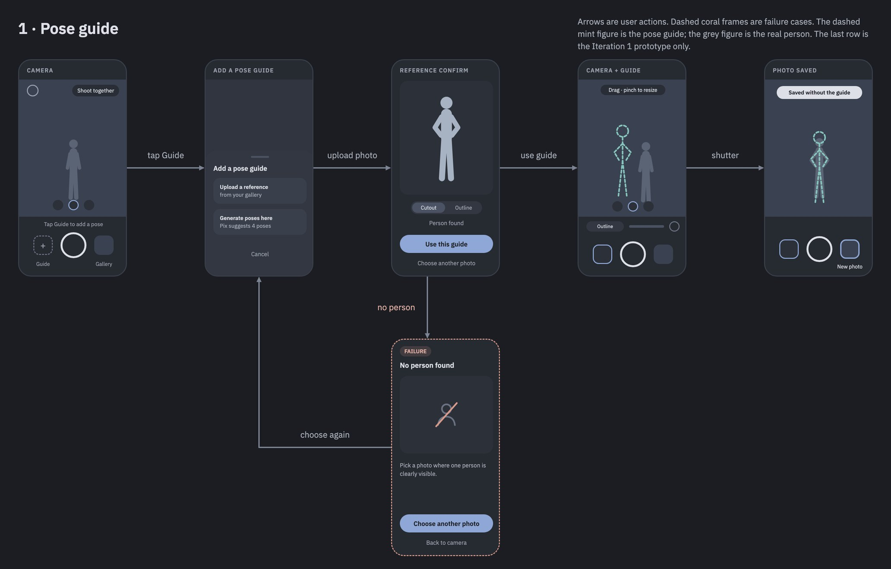
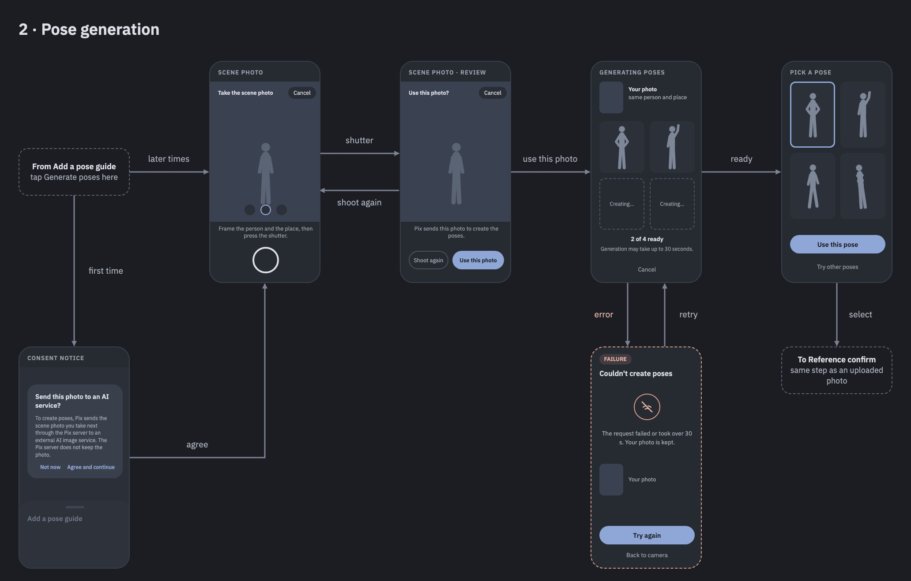
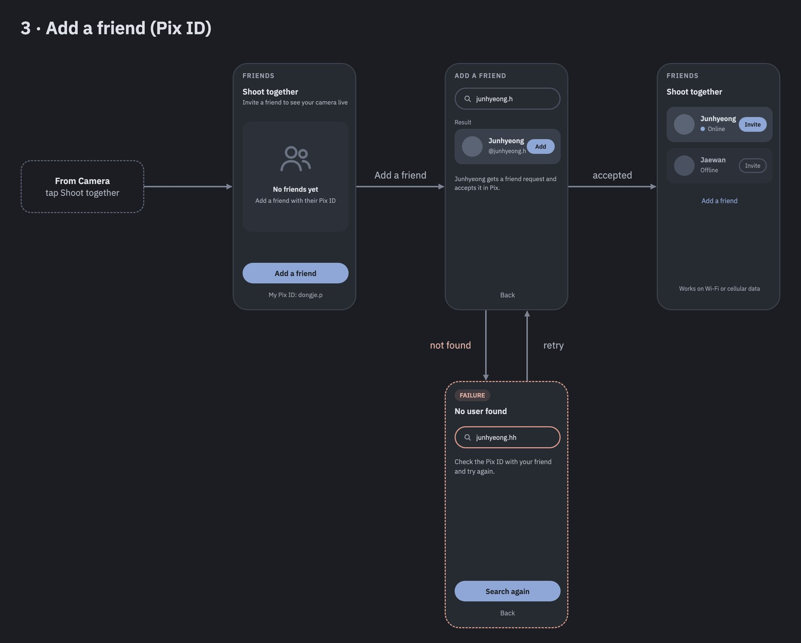
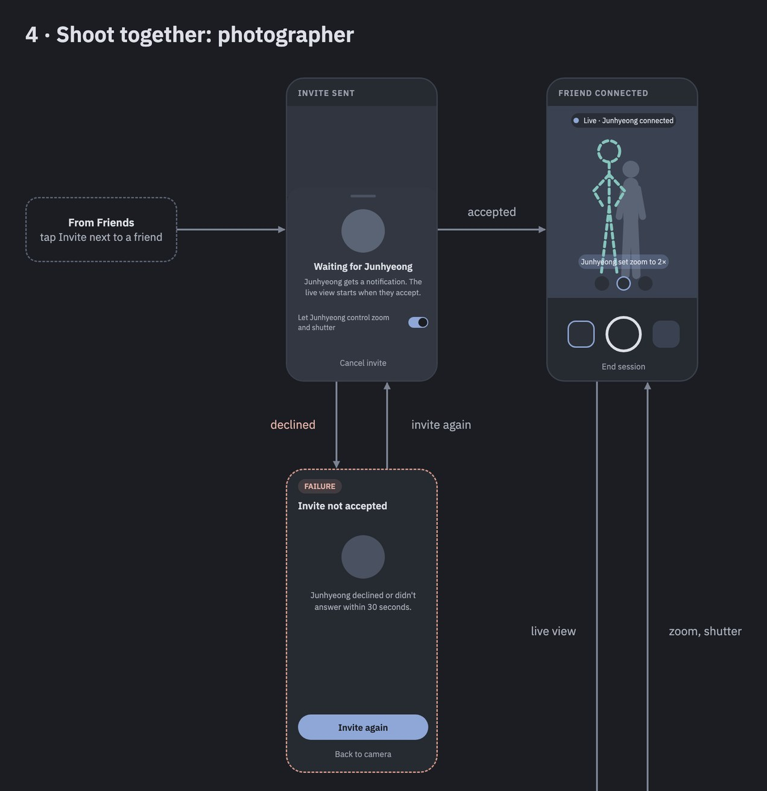
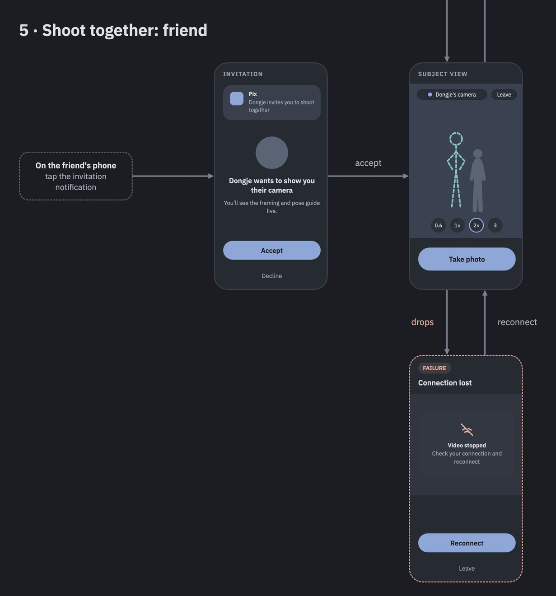
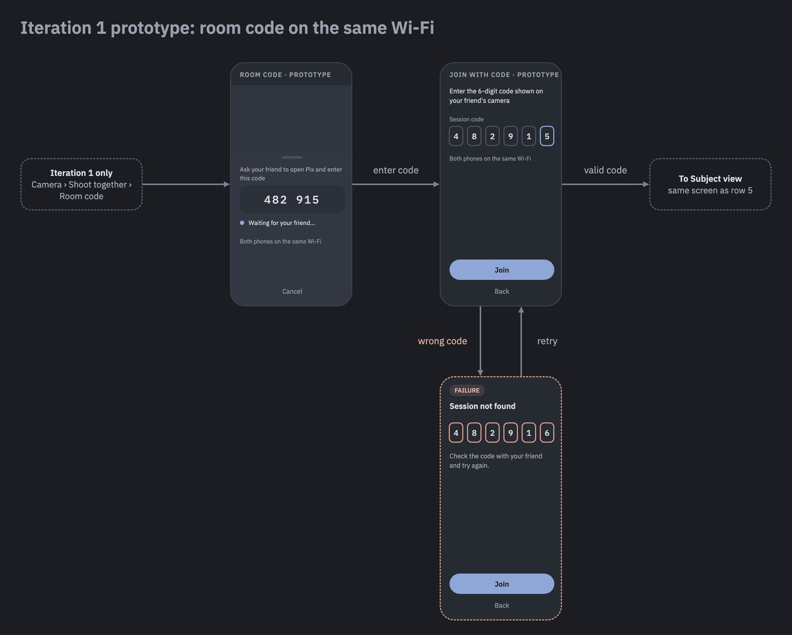

## Document Revision History

| Version | Date | Key changes |
|---|---|---|
| 0.1 | 2026-09-30 | Initial draft: abstract, customers, competitive landscape, feature list, functional requirements, 14 user stories with acceptance criteria, non-functional requirements, wireframes with per-screen specifications, assumptions and scope, and glossary. |
| 0.2 | 2026-09-30 | Feature updates: saved guides (Iteration 2); room codes stay after Iteration 2, so Pix works without signing in; an offline connection with a QR code and a local hotspot that accepts one phone and starts only after both people confirm (F9, Iteration 3–4); guides that keep the reference's background (Iteration 3–4). Remote control: the subject changes the zoom in Iteration 1, and moves or resizes the guide and sets the brightness and flash in Iteration 2; the photographer takes every photo. Iteration 1 test setup: both phones and the server (a laptop) on the same Wi-Fi. Minimum Android version: Android 10. The scope table now lists Iterations 2, 3–4, and 5. |
| 0.3 | 2026-10-04 | The image-editing API is chosen: OpenRouter's Image API, with the model as a server setting (FR-4.3, section 7). NFR-13 now says that the server passes the scene photo on to that service. |
| 0.4 | 2026-10-05 | The user takes the scene photo and confirms it before it is sent: a Scene photo screen with a shutter, *Use this photo*, and *Shoot again* comes before Generating poses (FR-4.1, US-4, 6.2, 6.3). |

Items marked **TBD** need a team decision.

**Contents**
1. [Project Abstract](#1-project-abstract)
2. [Customer](#2-customer)
3. [Competitive Landscape](#3-competitive-landscape)
4. [Functional Requirements](#4-functional-requirements)
5. [Non-functional Requirements](#5-non-functional-requirements)
6. [User Interface Requirements](#6-user-interface-requirements)
7. [Assumptions, Constraints, and Out of Scope](#7-assumptions-constraints-and-out-of-scope)
8. [Glossary](#8-glossary)

---

## 1. Project Abstract

Pix is an Android camera app that helps two people get the portrait one of them has in mind. When friends photograph each other, the person in the photo usually knows the pose and framing they want, but only the photographer sees the screen, which leads to repeated instructions and retakes. Pix gives both people the same view. The photographer adds a pose guide to the camera, either from a gallery photo or from one of four poses that Pix generates for the current scene with an image-editing AI. Pix separates the person from the background and shows them as a semi-transparent cutout or outline that can be moved, resized, and faded. The photographer then invites a friend added by Pix ID. Once the friend accepts, their phone shows the photographer's live camera view with the same guide, over Wi-Fi or cellular data. With the photographer's permission, the friend can also adjust the shot from their own phone: the zoom, and later the guide's position and size, the brightness, and the flash. The photographer takes the photo, and it is saved at full quality without the guide. Without an account, two phones on the same Wi-Fi can also connect with a 6-digit room code, which is how Iteration 1 connects them. Later, a QR code will connect two phones even without internet.

---

## 2. Customer

### 2.1 General audience

Android smartphone users who regularly take photos of each other, such as friends, couples, and family members, on trips, during everyday outings, and for social media. They care about how the photo looks, but most of them are not trained photographers.

### 2.2 Specific customer types

| Customer type | Situation | What they need from Pix | Features |
|---|---|---|---|
| **Couples and friends on trips** | At a landmark, the person being photographed knows the shot they want, but the photographer cannot see it in their head. They shout instructions back and forth and retake many times. | Show the intended pose on the photographer's screen, and let the subject see the framing themselves. | F2, F3, F6, F7 |
| **Reference recreators** | They saved a photo from Instagram or Pinterest and want the same pose and framing at their own location. | Turn that photo into a guide that both people can see. | F2, F3, F6 |
| **People without a pose idea** | They are at a good spot but do not know which pose would look good there. Generic pose libraries do not match their place or outfit. | Pose ideas made from a photo of this person in this place. | F4 |
| **Self-directing subjects** | People who run a personal social media account and are often photographed by a partner or parent who is less careful about framing. | Adjust the zoom, the brightness, and the guide from their own phone. | F7 |

### 2.3 Two roles in one shoot

Every "shoot together" session has two people with two phones. Roles are decided per session, and the same user can be either one on another day. Both need Pix installed.

| Role | What they do | What they need |
|---|---|---|
| **Photographer** | Holds the phone that takes the photo, sets the pose guide, and invites the subject. | Quick guide setup and adjustment; to see what the subject changed; to decide whether the subject may control the camera. |
| **Subject** (the friend being photographed) | Stands in the photo and holds their own phone, usually in one hand. | The live framing with the same guide; a few large controls to adjust the zoom, and later the guide and the brightness. |

### 2.4 Example scenario

> Dongje and Junhyeong are at the Han River. Junhyeong wants a photo like one they saved on Instagram. Dongje opens Pix, which starts on the camera, taps *Guide*, and picks that photo. The person in it appears as an outline on the camera. Dongje drags it to the left third of the frame and taps *Invite* next to Junhyeong in the friend list. Junhyeong's phone shows a notification, and after *Accept*, Junhyeong sees Dongje's camera and the same outline. Junhyeong steps into the outline and taps 2× to zoom in, and Dongje's camera zooms in right away. When Junhyeong is in position, Dongje presses the shutter, and the saved photo does not include the outline.

---

## 3. Competitive Landscape

### 3.1 Market competitors

| Product | Platform | What it does | Gap for our situation |
|---|---|---|---|
| **Superpose** | iOS | AI pose camera that suggests poses and overlays a pose guide on the camera. | Only the photographer's screen shows the guide; not available on Android. |
| **Ulike** (ByteDance) | Android, iOS | Selfie and beauty camera with a library of pose samples shown as outlines. | Preset poses only; single screen. |
| **SayCheese** | Android | Turns a second phone into a remote viewfinder and shutter. | No pose guide, so the subject still has to guess the target pose. |
| **Galaxy Watch Camera Controller** | Galaxy Watch paired with a Galaxy phone | Shows the phone's camera preview on the watch, with shutter, zoom, and a 3-second timer. | Needs a watch paired to the camera phone; the screen is tiny; no pose guide. |

### 3.2 Feature comparison

| Feature | Superpose | Ulike | SayCheese | Watch Camera Controller | **Pix** |
|---|:---:|:---:|:---:|:---:|:---:|
| Pose suggestions made for the user's current scene | O | X | X | X | **O** |
| Pose guide overlaid on the camera preview | O | O | X | X | **O** |
| Guide made from the user's own reference photo | O | X | X | X | **O** |
| Subject sees the live framing on their own device | X | X | O | O | **O** |
| The same pose guide shown on the subject's device, in sync | X | X | X | X | **O** |
| Subject controls the camera remotely (for example, zoom) | X | X | O | O | **O** |
| Works with two ordinary phones (no extra hardware) | O | O | O | X | **O** |
| Available on Android | X | O | O | O | **O** |

Based on store listings and articles as of September 2026. Ulike's pose feature is described as a preset sample library, so "own reference photo" and "scene-based suggestions" are marked X.

### 3.3 How Pix differs

- **A shared view, not only a remote.** Remote-viewfinder products show the framing but not the goal. Pix shows the framing and the same pose guide on both phones, so the subject can match the pose without verbal instructions.
- **A guide from what the user actually wants.** The guide comes from the user's own reference photo or from poses generated for their current scene, not from a fixed library.
- **Friends anywhere, no extra device.** After adding each other once, two friends connect with one invitation over Wi-Fi or cellular data (Iteration 2 and later). Without an account, a room code works on the same Wi-Fi, and a QR code works even without internet (Iteration 3–4).
- **The photographer stays in control.** Remote control is allowed only with the photographer's permission, and only the photographer takes the photo.

---

## 4. Functional Requirements

### 4.1 Scope by iteration

| Iteration | What users can do by the end of it |
|---|---|
| **Iteration 1** 9/27 – 10/9 · prototype | Open the camera and take photos; add a guide from a gallery photo or from four generated poses (predefined pose templates); adjust the guide; connect a second phone **with a room code on the same Wi-Fi**; see the live view and guide on the second phone; change the zoom from the second phone. |
| **Iteration 2** from 10/11 · tentative · midterm 10/21 | Create a Pix ID; add friends; invite a friend **over Wi-Fi or cellular data**; accept or decline invitations; move and resize the guide, adjust the brightness, and switch the flash from the subject's phone; allow or block remote control; automatic reconnection; describe the desired pose in words; save guides and reuse them. Room codes stay for use without signing in. |
| **Iterations 3–4** tentative · heuristic evaluation 11/2, UAT 11/6 | Connect two phones without internet by scanning a QR code; guides that keep the reference's background; set the focus remotely; send photos to the subject; fixes from the heuristic evaluation. Key stories for the user acceptance test (UAT) are fixed by the end of Iteration 3. |
| **Iteration 5** tentative | Polish, stability, and performance against the non-functional requirements, based on UAT feedback. |

### 4.2 Feature list

Priority: **Must** = required for the product to make sense · **Should** = important, but the product works without it · **Could** = nice to have if time allows.

| ID | Feature | What it covers | Priority | Target |
|---|---|---|---|---|
| F1 | **Camera** | Opens straight to the live preview; shutter, zoom, tap to focus; saves full-quality photos to the gallery. | Must | It 1 |
| F2 | **Guide from a reference photo** | Pick a gallery photo; separate the person from the background on the device; preview as a cutout or outline. Later, the guide can keep the background too. | Must / Should | It 1 / It 3–4 |
| F3 | **Guide overlay** | Show the guide over the preview; move, resize, fade, switch style, hide, remove; never saved in photos. Save guides to reuse them. | Must / Should | It 1 / It 2 |
| F4 | **AI pose generation** | Four pose candidates of the same person in the same place, generated through the Pix server; pick one as the guide. Predefined poses first, then a pose described in words. | Must / Should | It 1 / It 2 |
| F5 | **Pix account and friends** | Optional sign-in, needed only for friends; Pix ID, search by exact Pix ID, friend requests, friend list with online status. | Must | It 2 |
| F6 | **Shoot-together session** | Invitation, live view on the subject's phone, guide sync, leaving and reconnecting, over Wi-Fi or cellular data. | Must | It 1 / It 2 |
| F7 | **Remote control** | From their own phone, the subject changes the zoom, then the guide's position and size, the brightness, and the flash. The photographer sees each action, can block it, and always takes the photo. Remote focus comes later. | Must / Should / Could | It 1 – 3 |
| F8 | **Room-code session** | 6-digit code on the same Wi-Fi, with no sign-in. The way to connect in Iteration 1, and kept afterward for people without an account. | Must | It 1 |
| F9 | **Offline connection (QR)** | The photographer's phone creates a local hotspot and shows a QR code; the subject scans it and connects without internet. One phone only, and both people confirm before the session starts. | Should | It 3–4 |

### 4.3 Detailed requirements

Each requirement describes one behavior the app must show. User stories in 4.4 refer to these IDs.

#### F1 · Camera
*Pix is a camera first; everything else sits on top of it.*

| ID | Requirement | Priority | Target |
|---|---|---|---|
| FR-1.1 | Pix opens directly to the rear-camera preview. No sign-in, menu, or splash screen comes before it. | Must | It 1 |
| FR-1.2 | On first launch Pix asks for camera permission. If it is denied, Pix explains why the camera is needed and shows a button that opens the system settings. | Must | It 1 |
| FR-1.3 | The camera screen has a shutter button and continuous two-finger pinch zoom within the phone's supported range, including 0.5× when the phone exposes that capability. The actual hardware minimum applies otherwise (for example 0.6× or 1×). Zoom is relative to the primary rear camera across lens switches. The currently applied zoom is displayed, and accessibility actions allow zooming in and out. | Must | It 1 |
| FR-1.4 | Tapping the preview focuses and sets exposure at that point. | Should | It 2 |
| FR-1.5 | Photos are saved at the camera's full resolution to a "Pix" album in the gallery. No guide or on-screen control is included. | Must | It 1 |
| FR-1.6 | After saving, "Saved without the guide" appears and the thumbnail updates. Tapping the thumbnail opens the photo in the gallery. | Must | It 1 |
| FR-1.7 | If saving fails (for example, storage is full), Pix shows why, and the camera and guide stay as they were. | Must | It 1 |
| FR-1.8 | The camera screen has entry points for *Guide* (add a pose guide) and *Shoot together*. | Must | It 1 |
| FR-1.9 | The photographer's preview shows a 3×3 composition grid. The actual 3:4 image is divided into three equal columns and three equal rows, excluding letterbox bars. | Must | It 1 |
| FR-1.10 | A horizon bar at the center of the middle grid cell follows device tilt and turns dark yellow when level. If the horizon cannot be determined, the bar is hidden. The grid and bar do not block gestures or appear in saved photos or streamed video. | Must | It 1 |

#### F2 · Guide from a reference photo
*Turn any photo of a person into a guide.*

| ID | Requirement | Priority | Target |
|---|---|---|---|
| FR-2.1 | *Upload a reference* opens the system photo picker, and the user picks one photo. Pix does not need access to the whole gallery. | Must | It 1 |
| FR-2.2 | Pix separates the person from the background on the phone and makes two guide styles: a semi-transparent cutout and an outline. | Must | It 1 |
| FR-2.3 | *Reference confirm* shows the result with a Cutout/Outline switch and two actions: *Use this guide* and *Choose another photo*. | Must | It 1 |
| FR-2.4 | If no person can be separated, Pix shows *No person found* with *Choose another photo* and *Back to camera*. | Must | It 1 |
| FR-2.5 | If the photo shows several people, such as a couple, all of them are kept in the guide. | Should | It 1 |
| FR-2.6 | The reference photo is processed only on the phone and is never uploaded. | Must | It 1 |
| FR-2.7 | Closing the picker without choosing returns to the camera, and any existing guide stays unchanged. | Must | It 1 |
| FR-2.8 | The user can choose a guide that keeps the reference's background, drawn faintly around the person, so that the framing of the place can be matched as well as the pose. | Should | It 3–4 |

#### F3 · Guide overlay
*Place the guide exactly where the person should stand.*

| ID | Requirement | Priority | Target |
|---|---|---|---|
| FR-3.1 | A confirmed guide appears over the live preview. It starts centered, at a size where the person fills about 70% of the preview height. | Must | It 1 |
| FR-3.2 | Dragging with one finger moves the guide. At least 20% of it always stays on screen. | Must | It 1 |
| FR-3.3 | Pinching resizes the guide between 30% and 300% of its starting size. | Must | It 1 |
| FR-3.4 | A slider changes the guide's opacity between 10% and 90%. | Must | It 1 |
| FR-3.5 | A toggle switches between cutout and outline and keeps the same position and size. | Must | It 1 |
| FR-3.6 | The user can hide the guide for a moment, remove it, or replace it with another one. | Should | It 2 |
| FR-3.7 | The guide's position and size are kept relative to the camera image rather than the screen, so the guide lands on the same part of the scene on a phone with a different screen size. | Must | It 1 |
| FR-3.8 | *Save guide* stores the current guide on the phone. *Add a pose guide* lists saved guides so the user can reuse or delete them. Saved guides never leave the phone. | Should | It 2 |

#### F4 · AI pose generation
*Pose ideas made for this person in this place.*

| ID | Requirement | Priority | Target |
|---|---|---|---|
| FR-4.1 | *Generate poses here* opens the camera for the scene photo. The user frames the subject and presses the shutter, then confirms the photo with *Use this photo* or takes another with *Shoot again*. Nothing is sent before the photo is confirmed. | Must | It 1 |
| FR-4.2 | Before the first request, Pix says that the scene photo will be sent to an external AI service and asks for consent. Without consent, nothing is sent. | Should | It 1 |
| FR-4.3 | Pix requests four candidates that keep the same person and background, through the Pix server. The server generates them with an image-editing model on OpenRouter; the model is a server setting (Design Documentation 2.6.3). | Must | It 1 |
| FR-4.4 | In Iteration 1 the four poses come from predefined templates: hands on hips, wave, walking, and arms crossed. | Must | It 1 |
| FR-4.5 | *Generating poses* shows the scene photo, each candidate as soon as it is ready, progress ("2 of 4 ready · up to 30 s"), and *Cancel*. | Must | It 1 |
| FR-4.6 | *Pick a pose* shows the candidates with labels. *Use this pose* sends the selected image to *Reference confirm* (F2). *Try other poses* requests a new set. | Must | It 1 |
| FR-4.7 | If no candidate arrives within 30 s or every request fails, Pix shows *Couldn't create poses* with *Try again* and *Back to camera*, and keeps the scene photo. If only some candidates fail, the others are still shown. | Must | It 1 |
| FR-4.8 | The user can describe the desired pose in Korean or English (up to 100 characters), and the candidates follow the description. | Should | It 2 |
| FR-4.9 | The Pix server does not keep the scene photo or the generated images after returning them. | Must | It 1 |

#### F5 · Pix account and friends
*Add a friend once, then connect with one tap.*

| ID | Requirement | Priority | Target |
|---|---|---|---|
| FR-5.1 | Pix works without an account: single-phone features (F1–F4), room codes (F8), and QR connections (F9) need no sign-in. Only friends and invitations need one. | Must | It 2 |
| FR-5.2 | The first time the user opens the friend list in *Shoot together*, Pix asks them to sign in (method **TBD**, for example a Google account) and choose a Pix ID. A Pix ID is 4–20 characters of lowercase letters, digits, "." and "_". | Must | It 2 |
| FR-5.3 | A Pix ID that is taken or breaks the rules is rejected with the reason, and nothing is saved. | Must | It 2 |
| FR-5.4 | The Friends screen shows the user's own Pix ID. Tapping it copies the ID. | Should | It 2 |
| FR-5.5 | *Add a friend* finds users only by their exact Pix ID. There is no public list or partial-match search. | Must | It 2 |
| FR-5.6 | *Add* sends a friend request. The two users become friends only after the other user accepts. | Must | It 2 |
| FR-5.7 | The receiver gets a notification and sees pending requests with *Accept* and *Decline*. | Must | It 2 |
| FR-5.8 | Search results mark special cases instead of showing *Add*: the user's own ID ("This is you"), an existing friend ("Friends"), and a pending request ("Requested"). | Should | It 2 |
| FR-5.9 | The friend list shows each friend's name, Pix ID, online status (Pix is open on their phone), and an *Invite* button. | Must | It 2 |
| FR-5.10 | The user can remove a friend. A removed user can no longer send invitations to them. | Should | It 2 |

#### F6 · Shoot-together session
*The subject sees what the camera sees, with the same guide.*

| ID | Requirement | Priority | Target |
|---|---|---|---|
| FR-6.1 | *Invite* sends an invitation that reaches the friend as a notification, even when Pix is closed on the friend's phone. | Must | It 2 |
| FR-6.2 | *Invite sent* shows "Waiting for &lt;name&gt;", the remote-control toggle (FR-7.5), and *Cancel invite*. | Must | It 2 |
| FR-6.3 | An invitation expires after 30 s. If it is declined or expires, the photographer sees *Invite not accepted* with *Invite again* and *Back to camera*. | Must | It 2 |
| FR-6.4 | The friend's *Invitation* screen shows who is inviting, with *Accept* and *Decline*. Opening an expired or cancelled invitation shows "This invitation is no longer available". | Must | It 2 |
| FR-6.5 | After *Accept*, the phones connect whether they are on the same Wi-Fi, on different Wi-Fi networks, or on cellular data. Pix relays through a server when a direct connection is not possible. | Must | It 2 |
| FR-6.6 | The subject's *Subject view* shows the photographer's live camera in portrait, the photographer's name ("Dongje's camera"), and *Leave*. | Must | It 1 |
| FR-6.7 | The guide appears on the subject's phone at the same relative position, size, opacity, and style as on the photographer's phone. It updates whenever the photographer changes, replaces, or removes it. | Must | It 1 |
| FR-6.8 | While connected, the photographer's camera shows "Live · &lt;name&gt; connected". | Must | It 1 |
| FR-6.9 | A session has exactly one photographer and one subject. Inviting a friend who is already in a session shows "&lt;name&gt; is in another session". | Should | It 2 |
| FR-6.10 | Either person can end the session (*End session* or *Leave*). The other person is told, and the photographer's camera keeps working on its own. | Must | It 1 |
| FR-6.11 | When the connection is lost, the subject sees *Connection lost* with *Reconnect* and *Leave*, and the photographer sees "&lt;name&gt; disconnected". | Must | It 1 |
| FR-6.12 | Before showing *Connection lost*, both phones try to reconnect automatically for up to 10 s. | Should | It 2 |
| FR-6.13 | The first time a session runs on cellular data, Pix says that the live view uses mobile data. | Should | It 2 |
| FR-6.14 | After a photo is taken in a session, the photographer can send it to the subject in full quality with one tap. | Could | It 3 |

#### F7 · Remote control
*The subject fine-tunes the shot from their phone; the photographer takes the photo.*

| ID | Requirement | Priority | Target |
|---|---|---|---|
| FR-7.1 | *Subject view* shows zoom chips that match the zoom levels of the photographer's camera. Tapping one changes the photographer's zoom, and the subject sees the result in the live view. | Must | It 1 |
| FR-7.2 | On *Subject view*, the subject can drag the guide to move it and pinch it to resize it, within the same limits as the photographer (FR-3.2, FR-3.3). Both phones show the change. Opacity and style stay with the photographer. | Must | It 2 |
| FR-7.3 | *Subject view* has a brightness slider (exposure compensation, within the range the photographer's camera supports) and a flash button (off, auto, on). The flash button is hidden if the photographer's phone has no flash. | Should | It 2 |
| FR-7.4 | The photographer sees a short notice for each remote action, such as "Junhyeong set zoom to 2×" or "Junhyeong moved the guide". | Should | It 1 |
| FR-7.5 | The photographer can allow or block remote control on *Invite sent* and change it during the session. While it is blocked, the subject's remote controls are disabled with the message "Dongje turned off remote control". | Must | It 2 |
| FR-7.6 | The photographer's own controls always keep working, and only the photographer takes photos. If both people change the zoom, the guide, or the brightness at the same moment, the later change wins and both phones show the same final value. | Must | It 1 |
| FR-7.7 | The subject can also set the focus point remotely. | Could | It 3 |

#### F8 · Room-code session
*Connect on the same Wi-Fi without an account.*

| ID | Requirement | Priority | Target |
|---|---|---|---|
| FR-8.1 | *Shoot together* offers *Start* (show a code) and *Join* (enter a code). From Iteration 2 they sit next to the friend list and work without signing in. *Start* shows a 6-digit code, "Waiting for your friend…", and *Cancel*. | Must | It 1 |
| FR-8.2 | *Join with code* accepts digits only. *Join* stays disabled until all 6 digits are entered. | Must | It 1 |
| FR-8.3 | A valid code opens *Subject view*. An unknown or expired code shows *Session not found* and keeps the entered code for editing. | Must | It 1 |
| FR-8.4 | A code expires when the photographer cancels, or after 10 minutes if nobody joins. | Should | It 1 |
| FR-8.5 | Both screens state that both phones must be on the same Wi-Fi. If the phones cannot connect, Pix shows "Couldn't connect. Make sure both phones are on the same Wi-Fi." | Must | It 1 |

#### F9 · Offline connection with a QR code
*Connect two phones anywhere, even without internet or a shared Wi-Fi.*

| ID | Requirement | Priority | Target |
|---|---|---|---|
| FR-9.1 | *Shoot together* offers *Show QR*. The photographer's phone creates a local hotspot, which has no internet, and shows a QR code with its connection details. | Should | It 3–4 |
| FR-9.2 | *Scan QR* on the subject's phone reads the code, joins the hotspot, and connects to the photographer's phone without the Pix server. No sign-in is needed. | Should | It 3–4 |
| FR-9.3 | For security, the photographer's phone accepts only one phone per QR code. Later attempts are refused. | Should | It 3–4 |
| FR-9.4 | When a phone connects, both phones show "Connected" with the other phone's name. The live view and remote control start only after both people tap *Resume*, so a stranger who connected first cannot join unnoticed. *Cancel* ends the connection and shows a new QR code. | Should | It 3–4 |
| FR-9.5 | The session works over the hotspot alone. Pose generation still needs the photographer's phone to have its own internet connection. | Should | It 3–4 |

### 4.4 User stories and acceptance criteria

Each story lists its scenarios in Given-When-Then form. **Normal** is the expected path, **Failure** is an error or a rejected input, and **Edge** is an unusual but valid situation. Stories marked "UAT candidate" are proposals; the final UAT set is fixed by the end of Iteration 3.

#### US-1 · Take a photo right after opening Pix
F1 · FR-1.1–1.8 · Iteration 1

> As a photographer, I want Pix to open straight to the camera, so that I do not miss the moment.

| Case | Given | When | Then |
|---|---|---|---|
| **Normal** | Camera permission is granted | I open Pix | The rear-camera preview appears within 2 s, with the shutter, applied zoom readout, composition grid, horizon bar when available, *Guide*, and *Shoot together*. |
| **Normal** | The preview is showing | I tap the shutter | The photo is saved to the "Pix" album within 2 s, a confirmation appears, and the thumbnail updates. |
| **Failure** | I denied camera permission | Pix opens | Pix explains why it needs the camera and shows *Open settings* instead of a blank preview. |
| **Failure** | The phone's storage is full | I tap the shutter | "Couldn't save the photo. Free up storage and try again." appears, and the camera stays ready. |

#### US-2 · Turn a gallery photo into a pose guide
F2 · FR-2.1–2.7 · Iteration 1 · UAT candidate

> As a photographer, I want to pick a reference photo from my gallery and see the person in it on my camera screen, so that I can frame the shot the way my friend wants.

| Case | Given | When | Then |
|---|---|---|---|
| **Normal** | I tapped *Guide › Upload a reference* | I choose a photo with a clearly visible person | *Reference confirm* shows the person as a cutout within 2 s, with a Cutout/Outline switch. |
| **Normal** | *Reference confirm* is showing | I tap *Use this guide* | The camera shows the guide over the live preview. |
| **Failure** | I chose a photo with no person, such as a landscape | Processing finishes | *No person found* appears. *Choose another photo* reopens the picker, and *Back to camera* returns without a guide. |
| **Edge** | The photo shows two people | Processing finishes | Both people are included in the guide. |
| **Edge** | The photo picker is open and a guide was already set | I close the picker without choosing | I return to the camera, and the existing guide is unchanged. |

#### US-3 · Adjust the guide to my composition
F3 · FR-3.1–3.7, FR-1.5 · Iteration 1

> As a photographer, I want to move, resize, fade, and restyle the guide, so that it matches the composition without hiding the scene.

| Case | Given | When | Then |
|---|---|---|---|
| **Normal** | A guide is on the preview | I drag it with one finger | It follows my finger, and the preview stays smooth. |
| **Normal** | A guide is on the preview | I pinch it | It grows or shrinks, and stops at 30% and 300% of its starting size. |
| **Normal** | A guide is on the preview | I move the opacity slider or tap the style toggle | The opacity changes between 10% and 90%, or the style switches between cutout and outline at the same position and size. |
| **Normal** | A guide is visible | I take a photo | The saved photo does not contain the guide. |
| **Edge** | I am dragging the guide toward the edge | I keep dragging past the edge | It stops when only 20% of it is still on screen, so it cannot be lost. |

#### US-4 · Get pose ideas that fit this place
F4 · FR-4.1–4.7, FR-4.9 · Iteration 1 · UAT candidate

> As a user without a reference photo, I want Pix to suggest poses from a photo of where we are, so that I get ideas that fit this place and this person.

| Case | Given | When | Then |
|---|---|---|---|
| **Normal** | My friend is in the camera frame, and the phone is online | I tap *Guide › Generate poses here* (and agree to the notice the first time), press the shutter, and tap *Use this photo* | *Generating poses* shows my scene photo and fills in each candidate as it arrives, with "n of 4 ready". |
| **Edge** | The scene photo I just took is shown | I tap *Shoot again* | The camera is shown again, and nothing is sent. |
| **Normal** | The candidates are shown | I select one and tap *Use this pose* | It opens in *Reference confirm*, the same as an uploaded photo. |
| **Normal** | The candidates are shown | I tap *Try other poses* | A new set is requested with the same scene photo. |
| **Failure** | The phone is offline, the server fails, or 30 s pass with no candidate | Generation stops | *Couldn't create poses* appears with my scene photo kept. *Try again* resends the same photo. |
| **Failure** | The consent notice is shown for the first time | I tap *Not now* | Nothing is sent, and I return to *Add a pose guide*. |
| **Edge** | Three candidates succeeded and one failed | Generation ends | The three candidates are shown and can be used. |
| **Edge** | Generation is in progress | I tap *Cancel* | The results are discarded, and I return to the camera. |

#### US-5 · Describe the pose I want
F4 · FR-4.8 · Iteration 2

> As a user, I want to describe the pose I want in my own words, so that the suggestions match my idea.

| Case | Given | When | Then |
|---|---|---|---|
| **Normal** | I typed "벽에 기대서 한 손은 주머니에" (leaning on the wall, one hand in a pocket) | I request poses | The candidates show that pose with the same person and place. |
| **Edge** | The description field is empty | I request poses | Pix uses the predefined poses. |
| **Failure** | I am typing a description | I go past 100 characters | Further input is blocked, and the counter shows 100/100. |
| **Failure** | The AI service rejects the description | The response arrives | Pix shows "Try a different description" and keeps my text. |

#### US-6 · Get my Pix ID
F5 · FR-5.1–5.4 · Iteration 2

> As a new user, I want to create a Pix ID the first time I use Shoot together, so that my friends can find me.

| Case | Given | When | Then |
|---|---|---|---|
| **Normal** | I have no account | I tap *Shoot together*, sign in, and save the Pix ID "dongje.p" | *Friends* opens and shows "My Pix ID: dongje.p". |
| **Failure** | "dongje.p" is already used | I tap *Save* | "This Pix ID is taken" appears, and I stay on the screen with my input kept. |
| **Failure** | I typed "Dong Je!" | I look at the *Save* button | *Save* is disabled, and the rule (4–20 characters: a–z, 0–9, ".", "_") is shown. |
| **Edge** | I have no account | I use the camera, guides, or pose generation | Pix never asks me to sign in. |

#### US-7 · Add a friend by Pix ID
F5 · FR-5.5–5.9 · Iteration 2

> As a user, I want to find my friend by their Pix ID and send a friend request, so that I can invite them with one tap later.

| Case | Given | When | Then |
|---|---|---|---|
| **Normal** | I am on *Add a friend* | I search for "junhyeong.h" | The result shows Junhyeong (@junhyeong.h) with *Add*. |
| **Normal** | The result is shown | I tap *Add* | The button changes to "Requested". After Junhyeong accepts, Junhyeong appears in my friend list. |
| **Failure** | No user has the ID "junhyeong.hh" | I search for it | *No user found* appears. *Search again* keeps my text so I can fix it. |
| **Edge** | I type only part of an ID, such as "junhyeong" | I search | *No user found* appears, because only exact IDs match. |
| **Edge** | I search for my own ID or for an existing friend | The result appears | It shows "This is you" or "Friends" instead of *Add*. |

#### US-8 · Answer a friend request
F5 · FR-5.6–5.7 · Iteration 2

> As a user who received a friend request, I want to accept or decline it, so that only people I know can invite me.

| Case | Given | When | Then |
|---|---|---|---|
| **Normal** | Seongmin sent me a friend request | I open the notification | I see the request with *Accept* and *Decline*. |
| **Normal** | The request is shown | I tap *Accept* | Seongmin and I appear in each other's friend lists. |
| **Edge** | The request is shown | I tap *Decline* | The request disappears. Seongmin is not notified and can send a request again later. |

#### US-9 · Invite a friend to shoot together
F6, F7 · FR-6.1–6.5, FR-6.9, FR-7.5 · Iteration 2 · UAT candidate

> As a photographer, I want to invite a friend from my list, so that they can see my camera from where they are standing without typing a code.

| Case | Given | When | Then |
|---|---|---|---|
| **Normal** | Junhyeong is in my friend list | I tap *Invite* | *Invite sent* shows "Waiting for Junhyeong", and Junhyeong gets a notification within 5 s. |
| **Normal** | I am on Wi-Fi and Junhyeong is on cellular data | Junhyeong accepts | My camera shows "Live · Junhyeong connected" within 10 s. |
| **Failure** | The invitation is waiting | Junhyeong declines, or 30 s pass | *Invite not accepted* appears with *Invite again* and *Back to camera*. |
| **Edge** | The invitation is waiting | I tap *Cancel invite* | I return to *Friends*. If Junhyeong opens the invitation now, it says it is no longer available. |
| **Edge** | Junhyeong is already in another session | I tap *Invite* | "Junhyeong is in another session" appears, and no invitation is sent. |
| **Edge** | Junhyeong is shown as offline because Pix is closed | I tap *Invite* | Junhyeong still receives the invitation as a notification. |

#### US-10 · See the photographer's framing live
F6 · FR-6.4, 6.6, 6.10–6.12 · Iteration 1 (room code) → Iteration 2 (invitation) · UAT candidate

> As a subject, I want to see the photographer's camera view on my own phone, so that I can fix my position and pose myself.

| Case | Given | When | Then |
|---|---|---|---|
| **Normal** | I received Dongje's invitation | I tap the notification and then *Accept* | *Subject view* shows "Dongje's camera" live within 10 s. |
| **Normal** | We are connected over Wi-Fi | Dongje moves the phone | My view follows with a delay of 0.5 s or less. |
| **Normal** | We are connected | I tap *Leave* | I return to my own camera, and Dongje sees "Junhyeong left". |
| **Failure** | We are connected | The connection drops and does not recover within 10 s | *Connection lost* appears. *Reconnect* rejoins without a new invitation if Dongje is still in the session; *Leave* returns to my camera. |
| **Edge** | The invitation expired or was cancelled | I tap the old notification | "This invitation is no longer available" appears. |

#### US-11 · See the same guide on both phones
F3, F6 · FR-3.7, FR-6.7 · Iteration 1 · UAT candidate

> As a subject, I want the guide on my phone to match the photographer's, so that we both aim at the same target.

| Case | Given | When | Then |
|---|---|---|---|
| **Normal** | Dongje set a guide before I joined | I join the session | The same guide appears on my phone at the same relative position, size, opacity, and style. |
| **Normal** | Both phones show the guide | Dongje drags, pinches, fades, or restyles it | My phone shows the same change within 0.3 s. |
| **Normal** | Both phones show the guide | Dongje removes or replaces it | My phone removes or replaces it too. |
| **Edge** | My screen has a different aspect ratio from Dongje's | The guide is shown | It covers the same part of the camera image; the offset is at most 3% of the frame width. |
| **Failure** | I am on *Subject view* | I look for the guide's opacity or style controls | There are none; only Dongje changes the opacity and style. In Iteration 1, I cannot move or resize the guide either (FR-7.2 adds this in Iteration 2). |

#### US-12 · Adjust the shot from my phone
F7 · FR-7.1–7.6 · Iteration 1 (zoom) → Iteration 2 (guide, brightness, flash, permission) · UAT candidate

> As a subject, I want to adjust the photographer's zoom, the guide, and the brightness from my phone, so that I get the framing I want without shouting instructions.

| Case | Given | When | Then |
|---|---|---|---|
| **Normal** | We are connected and remote control is allowed | I tap 2× | Dongje's camera zooms to 2×, I see it within 0.5 s, and Dongje sees "Junhyeong set zoom to 2×". |
| **Normal** | We are connected and remote control is allowed (It 2) | I drag the guide to the right and pinch it larger | The guide moves and grows on both phones, and Dongje sees "Junhyeong moved the guide". |
| **Normal** | We are connected and remote control is allowed (It 2) | I raise the brightness slider | Dongje's preview and my live view get brighter within 0.5 s. |
| **Failure** | Dongje turned off remote control (It 2) | I look at my controls | My remote controls are disabled with "Dongje turned off remote control". The live view continues. |
| **Edge** | Dongje's phone has no ultra-wide lens | *Subject view* opens | The 0.6× chip is not shown. |
| **Edge** | Dongje's phone has no flash (It 2) | *Subject view* opens | The flash button is not shown. |
| **Edge** | Dongje and I change the zoom at almost the same moment | Both changes arrive | The later change wins, and both phones show the same zoom level. |

#### US-13 · Join with a room code
F8 · FR-8.1–8.5 · Iteration 1

> As a subject without a Pix account, I want to join the photographer's session by entering a 6-digit code, so that we can shoot together on the same Wi-Fi without signing in.

| Case | Given | When | Then |
|---|---|---|---|
| **Normal** | Both phones are on the same Wi-Fi and the photographer's phone shows a code | I enter the code and tap *Join* | *Subject view* opens within 10 s. |
| **Failure** | I entered a code that does not exist or has expired | I tap *Join* | *Session not found* appears, and my code stays in the boxes for editing. |
| **Failure** | I am on *Join with code* | I try to type letters, or I have entered fewer than 6 digits | Letters are not accepted, and *Join* stays disabled. |
| **Failure** | The phones are on different networks | I tap *Join* with a valid code | "Couldn't connect. Make sure both phones are on the same Wi-Fi." appears. |

#### US-14 · Get the photos on my phone
F6 · FR-6.14 · Iteration 3 · Could

> As a subject, I want to receive the photos taken of me during the session, so that I do not have to ask for them afterward.

| Case | Given | When | Then |
|---|---|---|---|
| **Normal** | Dongje took a photo during our session | Dongje taps *Send to Junhyeong* | The photo arrives in my "Pix" album at full resolution. |
| **Failure** | A photo is being sent | The connection drops | Sending resumes after reconnecting. If the session has ended, Dongje sees "Couldn't send". |

---

## 5. Non-functional Requirements

Targets are measured on a Galaxy S22 unless stated otherwise. "(It 2)" means the requirement applies once that feature exists.

| ID | Category | Requirement | How we check it |
|---|---|---|---|
| NFR-1 | Performance | The camera preview appears within 2 s of tapping the app icon (cold start). | Screen recording; median of 10 launches. |
| NFR-2 | Performance | The preview stays at 30 fps or more while a guide is shown and being dragged or pinched. | Frame-rate profiling during 30 s of dragging. |
| NFR-3 | Response latency | A reference photo (up to 12 MP) is ready on *Reference confirm* within 2 s. | Timing logs; 90th percentile over 10 photos. |
| NFR-4 | Response latency | The first pose candidate appears within 20 s and all four within 30 s. Requests stop at 30 s. | Timing logs over 10 requests on Wi-Fi. |
| NFR-5 | Response latency | The live view on the subject's phone lags the real scene by at most 0.5 s on the same Wi-Fi and at most 0.8 s over cellular data or a relay (It 2). | Point the camera at a running stopwatch and photograph both screens together; 10 samples per network. |
| NFR-6 | Quality | The live view runs at 720p and 24 fps or more on Wi-Fi. On a weak network it lowers quality, but not below 480p and 15 fps, instead of freezing. | Connection statistics logged during sessions. |
| NFR-7 | Response latency | Guide changes appear on the other phone within 0.3 s. A remote zoom (and, from Iteration 2, a remote guide or brightness change) is visible within 0.5 s. | Timestamps logged on both phones; 20 actions each. |
| NFR-8 | Accuracy | The guide's position differs between the two phones by at most 3% of the frame width, including phones with different aspect ratios. | Screenshots from both phones; compare the guide center. |
| NFR-9 | Response latency | 95% of invitations arrive within 5 s. The live view starts within 10 s after *Accept*. (It 2) | 20 invitations with logged times. |
| NFR-10 | Reliability | At least 90% of sessions connect in each network combination: same Wi-Fi, different Wi-Fi, Wi-Fi with cellular, and cellular with cellular. (It 2) | 10 trials per combination. |
| NFR-11 | Reliability | A drop shorter than 10 s recovers without a new invitation. Switching from Wi-Fi to cellular during a session does not crash the app. (It 2) | Turn on airplane mode for 5 s during a session; switch Wi-Fi off. |
| NFR-12 | Resource use | A 10-minute session uses at most 10% of the photographer's battery. The live view uses at most 2.5 Mbps, about 190 MB per 10 minutes. | Battery statistics; bitrate from connection statistics. |
| NFR-13 | Privacy | Reference photos never leave the phone. A scene photo is sent only when the user asks for poses, only to the Pix server, which passes it to the image-editing service to generate the poses (FR-4.2) and keeps no copy once the response is returned. Nothing from the live view is recorded or stored on any server. | Code review; server log review. |
| NFR-14 | Security | API keys exist only on the server. All server traffic uses HTTPS or WSS. The live view and control messages are encrypted end to end between the phones, and a relay server cannot read them. | Inspect the APK for keys; configuration review. |
| NFR-15 | Access control | Only accepted friends can invite each other. Pix IDs are found only by exact match. Remote control works only while the photographer allows it. (It 2) A QR connection accepts only one phone and starts only after both people tap *Resume*. (It 3–4) | API tests with non-friend and blocked cases; a third phone tries to join a QR session. |
| NFR-16 | Usability | Controls on *Subject view* are at least 48 dp and reachable with one thumb. Every failure screen says what happened and offers both a retry and a way back. A first-time user can add a guide and take a photo without help. | Hallway test with 5 people: at least 4 finish "add a guide and shoot" within 1 minute. |
| NFR-17 | Compatibility | Pix runs on Android phones in portrait orientation. It is tested on a Galaxy S22 and a Galaxy S23 Ultra. The minimum version is Android 10 (API 29). | Full test pass on both devices each iteration. |
| NFR-18 | Scalability | The server handles at least 50 sessions at the same time (100 users). This is sized for demos and the UAT, not for a public launch. | Load test script. |

---

## 6. User Interface Requirements

### 6.1 Wireframe overview

The low-fidelity wireframe is drawn as a wireflow: each row is one task, arrows are user inputs or system events, and failure screens hang below the step where they occur.

- **Arrows**: user input or system event, labeled
- **Dashed coral frame**: failure case
- **Dashed mint figure**: the pose guide
- **Grey figure**: the real person

In the tables below, **Input → result** lists what the user can do on the screen and where it leads. **Not allowed / failure** lists blocked inputs and what the screen does when something goes wrong.

### 6.2 Flow 1 · Add a pose guide from a photo

*Figure 1. Camera → Add a pose guide → Reference confirm → Camera + guide → Photo saved, with the "No person found" failure*

| Screen | Shows | Input → result | Not allowed / failure |
|---|---|---|---|
| **Camera** | Live preview with a 3×3 grid and centered horizon bar; *Shoot together* (top); applied zoom readout; *Guide*, shutter, gallery thumbnail (bottom); hint "Tap Guide to add a pose". | *Guide* → Add a pose guide · Shutter → Photo saved · *Shoot together* → Friends (It 2) or room code (It 1) · Thumbnail → system gallery · Two-finger pinch → continuous zoom · Align phone → dark yellow horizon bar. | Permission denied → explanation and *Open settings*. Camera busy in another app → "Camera unavailable" with *Retry*. Unknown horizon or no sensor → hide the bar, retain the grid. |
| **Add a pose guide** | Bottom sheet with *Upload a reference*, *Generate poses here*, and *Cancel*. | *Upload a reference* → system photo picker → Reference confirm · *Generate poses here* → Scene photo (Flow 2) · *Cancel* or swipe down → Camera. | Picker closed without a choice → Camera with the old guide kept. |
| **Reference confirm** | The separated person; Cutout/Outline switch; "Person found". | *Use this guide* → Camera + guide · *Choose another photo* → picker · Switch → preview the other style. | No person → No person found. |
| **Camera + guide** | Guide over the preview; hint "Drag · pinch to resize"; style toggle; opacity slider; shutter. | Drag → move · Pinch → resize · Slider → opacity · Toggle → cutout or outline · Shutter → Photo saved. | Size limited to 30–300%. At least 20% of the guide stays on screen. |
| **Photo saved** | "Saved without the guide"; thumbnail updated; camera still live. | Thumbnail → gallery · Shutter → another photo. | Save failed → reason shown; guide and camera unchanged. |
| **No person found** | Failure message: "Pick a photo where one person is clearly visible." | *Choose another photo* → picker · *Back to camera* → Camera without a guide. | — |

### 6.3 Flow 2 · Generate poses for this scene

*Figure 2. Generating poses → Pick a pose → Reference confirm, with the "Couldn't create poses" failure. The Scene photo screen comes before Generating poses and is not drawn in this figure.*

| Screen | Shows | Input → result | Not allowed / failure |
|---|---|---|---|
| **Scene photo** | The live camera with "Take the scene photo"; after the shutter, the photo that was taken with "Use this photo?". | *Shutter* → the photo is shown · *Use this photo* → Generating poses · *Shoot again* → the camera again · *Cancel* → Camera. | The shutter is disabled until the camera is ready. Nothing is sent before *Use this photo*. |
| **Generating poses** | The scene photo ("same person and place"); four slots that fill in as candidates arrive; "n of 4 ready · up to 30 s". | *Cancel* → Camera · All ready, or 30 s with at least one ready → Pick a pose. | Candidates cannot be selected until generation ends. No candidate, or an error → Couldn't create poses. |
| **Pick a pose** | 2×2 grid of candidates with labels (Hands on hips, Wave, Walking, Arms crossed); the selected one is highlighted. | Tap a candidate → select · *Use this pose* → Reference confirm (Flow 1) · *Try other poses* → Generating poses with a new set. | *Use this pose* is disabled until a candidate is selected. |
| **Couldn't create poses** | "The request failed or took over 30 s. Your photo is kept." and the scene photo. | *Try again* → Generating poses with the same photo · *Back to camera* → Camera. | — |

### 6.4 Flow 3 · Add a friend by Pix ID

*Figure 3. Friends (empty) → Add a friend → Friends (list), with the "No user found" failure*

| Screen | Shows | Input → result | Not allowed / failure |
|---|---|---|---|
| **Friends (empty)** | "Shoot together · Invite a friend to see your camera live"; "No friends yet"; "My Pix ID: dongje.p". | *Add a friend* → Add a friend · Tap own Pix ID → copied · System back → Camera. | No account yet → Pix ID setup first (screen to be drawn, see 6.8). |
| **Add a friend** | Search field for a Pix ID; result card with name, @ID, and *Add*; note "Junhyeong gets a friend request and accepts it in Pix." | Type an ID and search → result or No user found · *Add* → "Requested" · *Back* → Friends. | Characters other than a–z, 0–9, ".", "_" are not accepted. Search is disabled while the field is empty. Own ID, an existing friend, or a pending request → labeled instead of *Add*. |
| **Friends (list)** | Friend rows with name, Online/Offline, and *Invite*; *Add a friend*; "Works on Wi-Fi or cellular data". | *Invite* → Invite sent (Flow 4) · *Add a friend* → Add a friend · Long-press a friend → *Remove friend*. | Friend already in a session → "&lt;name&gt; is in another session". |
| **No user found** | The searched ID highlighted; "Check the Pix ID with your friend and try again." | *Search again* → Add a friend with the text kept · *Back* → Friends. | — |

### 6.5 Flow 4 · Shoot together, photographer's phone

*Figure 4. Invite sent → Friend connected, with the "Invite not accepted" failure. The vertical arrows lead to the subject's phone (Flow 5).*

| Screen | Shows | Input → result | Not allowed / failure |
|---|---|---|---|
| **Invite sent** | "Waiting for Junhyeong"; "Junhyeong gets a notification. The live view starts when they accept."; toggle "Let Junhyeong adjust the camera and guide" (on by default). | Toggle → allow or block remote control · *Cancel invite* → Friends · Friend accepts → Friend connected. | Declined or no answer in 30 s → Invite not accepted. |
| **Friend connected** | Camera + guide with the badge "Live · Junhyeong connected"; notices for remote actions ("Junhyeong set zoom to 2×"); *End session*. | All camera and guide inputs from Flow 1 · *End session* → Camera alone, and the subject is told · Remote zoom (and, from Iteration 2, guide, brightness, and flash) from the subject → applied here. | Subject leaves or disconnects → banner "Junhyeong left" or "Junhyeong disconnected"; the camera keeps working. |
| **Invite not accepted** | "Junhyeong declined or didn't answer within 30 seconds." | *Invite again* → Invite sent · *Back to camera* → Camera. | — |

### 6.6 Flow 5 · Shoot together, subject's phone

*Figure 5. Invitation → Subject view, with the "Connection lost" failure*

| Screen | Shows | Input → result | Not allowed / failure |
|---|---|---|---|
| **Invitation** | Opened from the notification "Dongje invites you to shoot together"; "You'll see the framing and pose guide live." | *Accept* → Subject view · *Decline* → closes, and the photographer sees Invite not accepted. | Expired or cancelled → "This invitation is no longer available" (screen to be drawn). |
| **Subject view** | Photographer's live camera with the synced guide; "Dongje's camera"; *Leave*; zoom chips (only levels the photographer's phone supports); from Iteration 2, a brightness slider and a flash button. No shutter. | Zoom chip → photographer's zoom changes · (It 2) drag or pinch the guide → it moves or resizes on both phones · (It 2) brightness slider or flash button → applied to the photographer's camera · *Leave* (or system back, then confirm) → own Camera. | The guide's opacity and style cannot be changed here, and in Iteration 1 it cannot be moved or resized either. Remote control blocked → controls disabled with a message. Connection lost → Connection lost. |
| **Connection lost** | "Video stopped · Check your connection and reconnect". | *Reconnect* → Subject view if the session is still open, otherwise "Session ended" → Camera · *Leave* → Camera. | — |

### 6.7 Flow 6 · Room code

*Figure 6. Room code → Join with code → Subject view, with the "Session not found" failure. From Iteration 2 it stays next to the friend list for people without an account.*

| Screen | Shows | Input → result | Not allowed / failure |
|---|---|---|---|
| **Room code** | 6-digit code ("482 915"); "Waiting for your friend…"; "Both phones on the same Wi-Fi". | *Cancel* → Camera, and the code expires · Friend joins → Friend connected (Flow 4). | Nobody joins in 10 minutes → code expires and the screen says so. |
| **Join with code** | Six digit boxes and a number keypad; "Both phones on the same Wi-Fi". | Enter 6 digits and *Join* → Subject view (Flow 5) · *Back* → Camera. | Letters are not accepted. *Join* is disabled until 6 digits are entered. Different networks → "Couldn't connect…". |
| **Session not found** | The entered code highlighted; "Check the code with your friend and try again." | Edit the code and *Join* → retry · *Back* → Camera. | — |

### 6.8 Screens still to be drawn

These screens follow from the requirements above but are not yet in the wireframe. Each is added before the iteration that builds it.

| Screen | Purpose | Requirement |
|---|---|---|
| Camera permission denied | Explain why the camera is needed; *Open settings*. | FR-1.2 |
| Pose generation consent | One-time notice that the scene photo is sent to an AI service; *Agree* / *Not now*. | FR-4.2 |
| Pix ID setup | Sign in, then choose a Pix ID with live rule checking. | FR-5.2, FR-5.3 |
| Friend requests | List of received requests with *Accept* / *Decline*. | FR-5.7 |
| Invitation no longer available | Shown when an expired or cancelled invitation is opened. | FR-6.4 |
| Subject view (update) | Remove *Take photo* from Flows 5 and 6; add the brightness slider and flash button (It 2). | FR-7.2, FR-7.3 |
| Subject view, control blocked | Disabled remote controls with the reason. | FR-7.5 |
| Pose description input | Text field (100 characters) on Add a pose guide. | FR-4.8 |
| Saved guides | *Save guide* on Camera + guide; the saved list on Add a pose guide. | FR-3.8 |
| Background option | A switch on Reference confirm that keeps the background in the guide. | FR-2.8 |
| Show QR, Scan QR, Connected | The QR code and hotspot status; the scanner; both phones confirm with *Resume*. | FR-9.1–9.4 |

### 6.9 Rules for every screen

- **Portrait only.** Every screen is designed for one-handed portrait use.
- **System back** does the same as the screen's secondary action (*Back* or *Cancel*). On *Subject view* and *Friend connected*, it first asks "Leave the session?".
- **Waiting states** always say what the app is waiting for and how long it may take, and offer *Cancel*.
- **Failure screens** always state what happened in plain words, offer a primary retry, and offer a way back. No screen is a dead end.
- **The guide** is always drawn in a color and dash pattern that is not used by any other UI element, so it is never mistaken for a control.

---

## 7. Assumptions, Constraints, and Out of Scope

**Assumptions**
- Both people have an Android phone with Pix installed.
- The photographer's phone has a rear camera. Multiple lenses are optional.
- Pose generation, friends, and invitations need an internet connection. The camera and gallery guides work offline, and from Iteration 3–4 two phones can connect offline with a QR code (F9).

**Constraints**
- The image-editing API has usage costs and rate limits. Pix uses OpenRouter's Image API, which bills each generated image, so the server limits how many poses one phone can request per hour.
- In Iteration 1, both phones and the Pix server, which runs on a laptop, are on the same Wi-Fi network, and the phones connect with a room code. Cellular connections need a relay server, planned for Iteration 2.
- Development follows the course schedule: about 10 hours of work per member per iteration.

**Out of scope**
- iOS, tablets, and landscape layouts.
- Video recording and sessions with more than two phones.
- Scoring how well the pose matches, and automatic capture (dropped after the team's early demo).
- Taking the photo from the subject's phone; the photographer always takes the photo.
- Beauty filters and photo editing.
- Public profiles or a social feed.
- Running the generative model on the phone.

---

## 8. Glossary

| Term | Meaning in this document |
|---|---|
| **Photographer** | The person holding the phone that takes the photo. |
| **Subject** | The friend in the photo, who joins the session from their own phone. |
| **Reference** | The photo that shows the desired pose: a gallery photo or a selected pose candidate. |
| **Guide** | The person from the reference drawn over the camera preview, as a **cutout** (semi-transparent image) or an **outline** (dashed contour). |
| **Pose candidate** | One of four images generated from the scene photo, showing the same person and place in a different pose. |
| **Session** | A live connection between one photographer's phone and one subject's phone. |
| **Live view** | The photographer's camera image as shown on the subject's phone. |
| **Remote control** | The subject adjusting the shot from their own phone: the zoom in Iteration 1, and the guide's position and size, the brightness, and the flash from Iteration 2. The photographer always takes the photo. |
| **Pix ID** | A unique user name, such as "junhyeong.h", that friends use to find each other. |
| **Room code** | A 6-digit code that connects two phones on the same Wi-Fi without an account. |
| **Relay** | A server that forwards the encrypted live view when the two phones cannot connect directly, for example on cellular data. |
| **QR connection** | Connecting two phones without internet: the photographer's phone creates a local hotspot and shows its details as a QR code, which the subject scans (Iteration 3–4). |
| **Saved guide** | A guide stored on the phone to reuse later (Iteration 2). |
